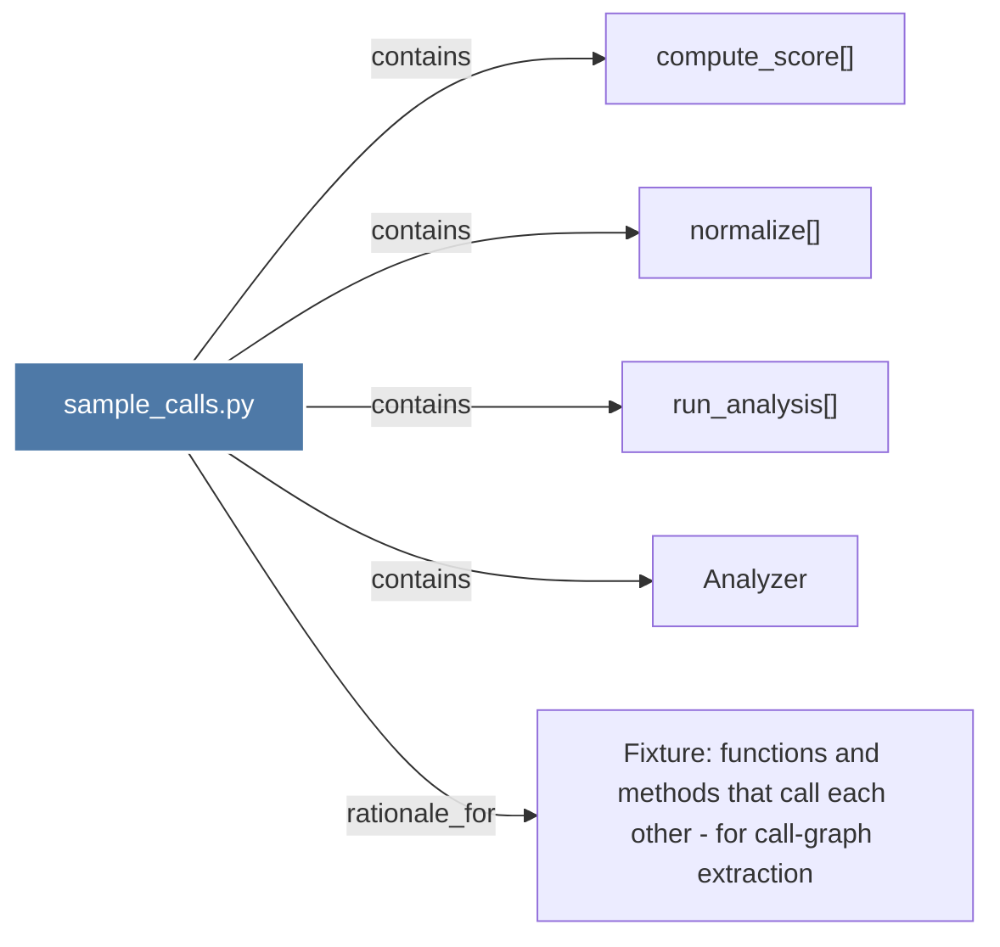

# sample_calls.py

> [!info] Properties
> **File Type**: code
> **Community**: [[_COMMUNITY_Community None|Community None]]
> **Degree**: 5

## Architecture Graph


## Outbound Connections
- [[Analyzer]] - `contains` [EXTRACTED]
- [[Fixture functions and methods that call each other - for call-graph extraction]] - `rationale_for` [EXTRACTED]
- [[compute_score()]] - `contains` [EXTRACTED]
- [[normalize()]] - `contains` [EXTRACTED]
- [[run_analysis()]] - `contains` [EXTRACTED]

## Inbound Dependencies
> [!abstract]- Files that link here
```dataview
LIST
FROM [[sample_calls.py]]
```

#graphify/code #graphify/EXTRACTED #community/Community_None