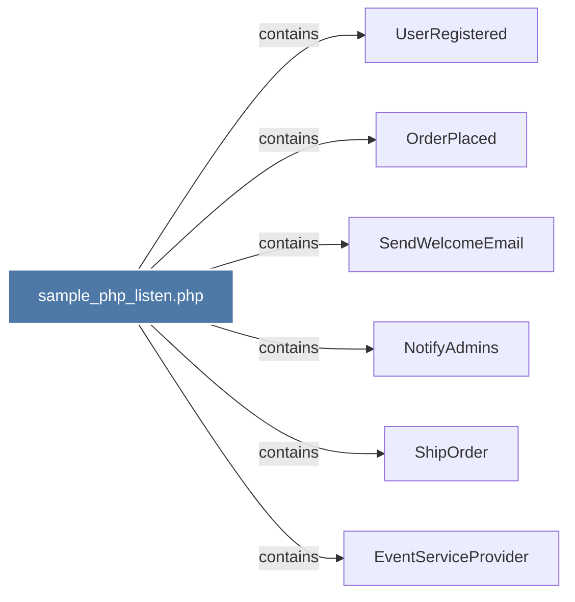

# sample_php_listen.php

> [!info] Properties
> **File Type**: code
> **Community**: [[_COMMUNITY_Community None|Community None]]
> **Degree**: 6

## Architecture Graph


## Outbound Connections
- [[EventServiceProvider]] - `contains` [EXTRACTED]
- [[NotifyAdmins]] - `contains` [EXTRACTED]
- [[OrderPlaced]] - `contains` [EXTRACTED]
- [[SendWelcomeEmail]] - `contains` [EXTRACTED]
- [[ShipOrder]] - `contains` [EXTRACTED]
- [[UserRegistered]] - `contains` [EXTRACTED]

## Inbound Dependencies
> [!abstract]- Files that link here
```dataview
LIST
FROM [[sample_php_listen.php]]
```

#graphify/code #graphify/EXTRACTED #community/Community_None