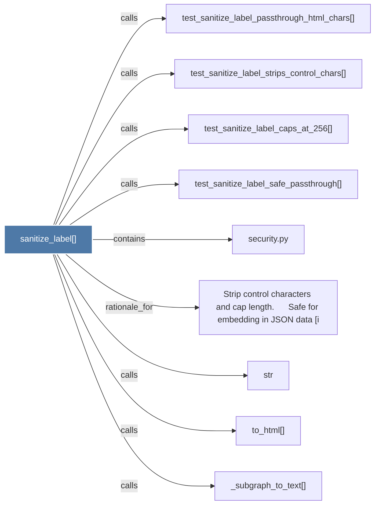

# sanitize_label()

> [!info] Properties
> **File Type**: code
> **Community**: [[_COMMUNITY_Community None|Community None]]
> **Degree**: 9

## Architecture Graph


## Outbound Connections
- [[Strip control characters and cap length.      Safe for embedding in JSON data (i]] - `rationale_for` [EXTRACTED]
- [[_subgraph_to_text()]] - `calls` [INFERRED]
- [[security.py]] - `contains` [EXTRACTED]
- [[str]] - `calls` [INFERRED]
- [[test_sanitize_label_caps_at_256()]] - `calls` [INFERRED]
- [[test_sanitize_label_passthrough_html_chars()]] - `calls` [INFERRED]
- [[test_sanitize_label_safe_passthrough()]] - `calls` [INFERRED]
- [[test_sanitize_label_strips_control_chars()]] - `calls` [INFERRED]
- [[to_html()]] - `calls` [INFERRED]

## Inbound Dependencies
> [!abstract]- Files that link here
```dataview
LIST
FROM [[sanitize_label()]]
```

#graphify/code #graphify/INFERRED #community/Community_None