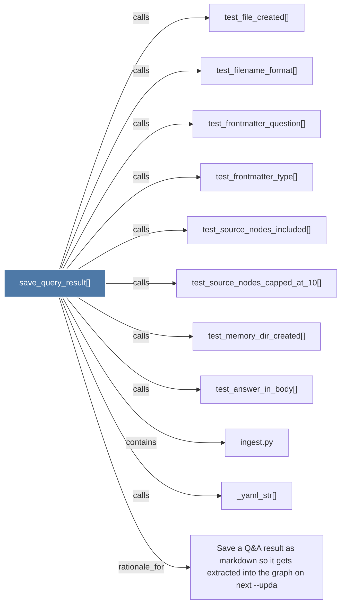

# save_query_result()

> [!info] Properties
> **File Type**: code
> **Community**: [[_COMMUNITY_Community None|Community None]]
> **Degree**: 11

## Architecture Graph


## Outbound Connections
- [[Save a Q&A result as markdown so it gets extracted into the graph on next --upda]] - `rationale_for` [EXTRACTED]
- [[_yaml_str()]] - `calls` [EXTRACTED]
- [[ingest.py]] - `contains` [EXTRACTED]
- [[test_answer_in_body()]] - `calls` [INFERRED]
- [[test_file_created()]] - `calls` [INFERRED]
- [[test_filename_format()]] - `calls` [INFERRED]
- [[test_frontmatter_question()]] - `calls` [INFERRED]
- [[test_frontmatter_type()]] - `calls` [INFERRED]
- [[test_memory_dir_created()]] - `calls` [INFERRED]
- [[test_source_nodes_capped_at_10()]] - `calls` [INFERRED]
- [[test_source_nodes_included()]] - `calls` [INFERRED]

## Inbound Dependencies
> [!abstract]- Files that link here
```dataview
LIST
FROM [[save_query_result()]]
```

#graphify/code #graphify/INFERRED #community/Community_None