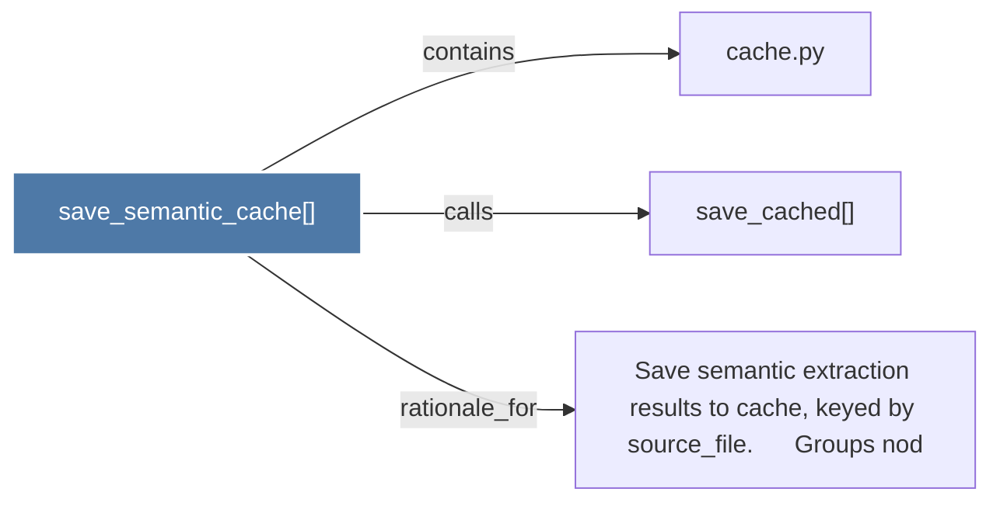

# save_semantic_cache()

> [!info] Properties
> **File Type**: code
> **Community**: [[_COMMUNITY_Community None|Community None]]
> **Degree**: 3

## Architecture Graph


## Outbound Connections
- [[Save semantic extraction results to cache, keyed by source_file.      Groups nod]] - `rationale_for` [EXTRACTED]
- [[cache.py]] - `contains` [EXTRACTED]
- [[save_cached()]] - `calls` [EXTRACTED]

## Inbound Dependencies
> [!abstract]- Files that link here
```dataview
LIST
FROM [[save_semantic_cache()]]
```

#graphify/code #graphify/EXTRACTED #community/Community_None