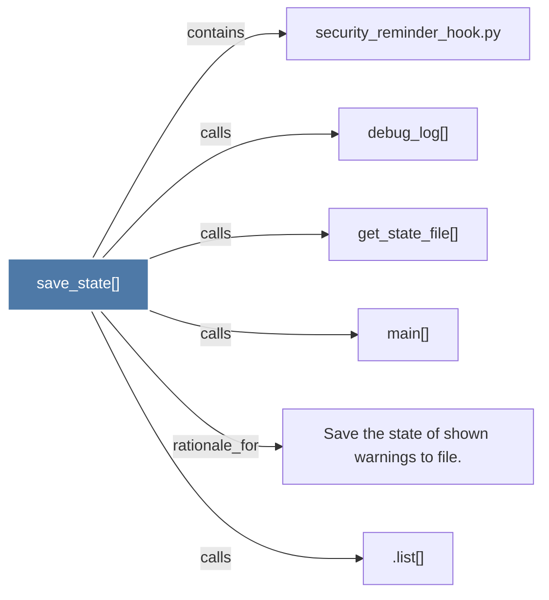

# save_state()

> [!info] Properties
> **File Type**: code
> **Community**: [[_COMMUNITY_Community None|Community None]]
> **Degree**: 6

## Architecture Graph


## Outbound Connections
- [[.list()]] - `calls` [INFERRED]
- [[Save the state of shown warnings to file.]] - `rationale_for` [EXTRACTED]
- [[debug_log()]] - `calls` [EXTRACTED]
- [[get_state_file()]] - `calls` [EXTRACTED]
- [[main()_8]] - `calls` [EXTRACTED]
- [[security_reminder_hook.py]] - `contains` [EXTRACTED]

## Inbound Dependencies
> [!abstract]- Files that link here
```dataview
LIST
FROM [[save_state()]]
```

#graphify/code #graphify/EXTRACTED #community/Community_None