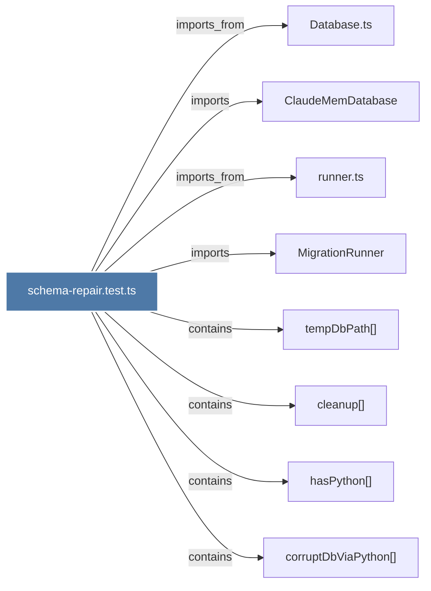

# schema-repair.test.ts

> [!info] Properties
> **File Type**: code
> **Community**: [[_COMMUNITY_Community None|Community None]]
> **Degree**: 8

## Architecture Graph


## Outbound Connections
- [[ClaudeMemDatabase]] - `imports` [EXTRACTED]
- [[Database.ts]] - `imports_from` [EXTRACTED]
- [[MigrationRunner]] - `imports` [EXTRACTED]
- [[cleanup()_1]] - `contains` [EXTRACTED]
- [[corruptDbViaPython()]] - `contains` [EXTRACTED]
- [[hasPython()]] - `contains` [EXTRACTED]
- [[runner.ts]] - `imports_from` [EXTRACTED]
- [[tempDbPath()]] - `contains` [EXTRACTED]

## Inbound Dependencies
> [!abstract]- Files that link here
```dataview
LIST
FROM [[schema-repair.test.ts]]
```

#graphify/code #graphify/EXTRACTED #community/Community_None