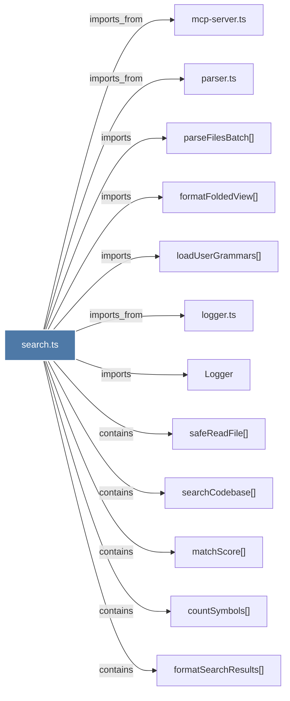

# search.ts

> [!info] Properties
> **File Type**: code
> **Community**: [[_COMMUNITY_Community None|Community None]]
> **Degree**: 12

## Architecture Graph


## Outbound Connections
- [[Logger]] - `imports` [EXTRACTED]
- [[countSymbols()]] - `contains` [EXTRACTED]
- [[formatFoldedView()]] - `imports` [EXTRACTED]
- [[formatSearchResults()]] - `contains` [EXTRACTED]
- [[loadUserGrammars()]] - `imports` [EXTRACTED]
- [[logger.ts]] - `imports_from` [EXTRACTED]
- [[matchScore()]] - `contains` [EXTRACTED]
- [[mcp-server.ts]] - `imports_from` [EXTRACTED]
- [[parseFilesBatch()]] - `imports` [EXTRACTED]
- [[parser.ts_1]] - `imports_from` [EXTRACTED]
- [[safeReadFile()]] - `contains` [EXTRACTED]
- [[searchCodebase()]] - `contains` [EXTRACTED]

## Inbound Dependencies
> [!abstract]- Files that link here
```dataview
LIST
FROM [[search.ts]]
```

#graphify/code #graphify/EXTRACTED #community/Community_None