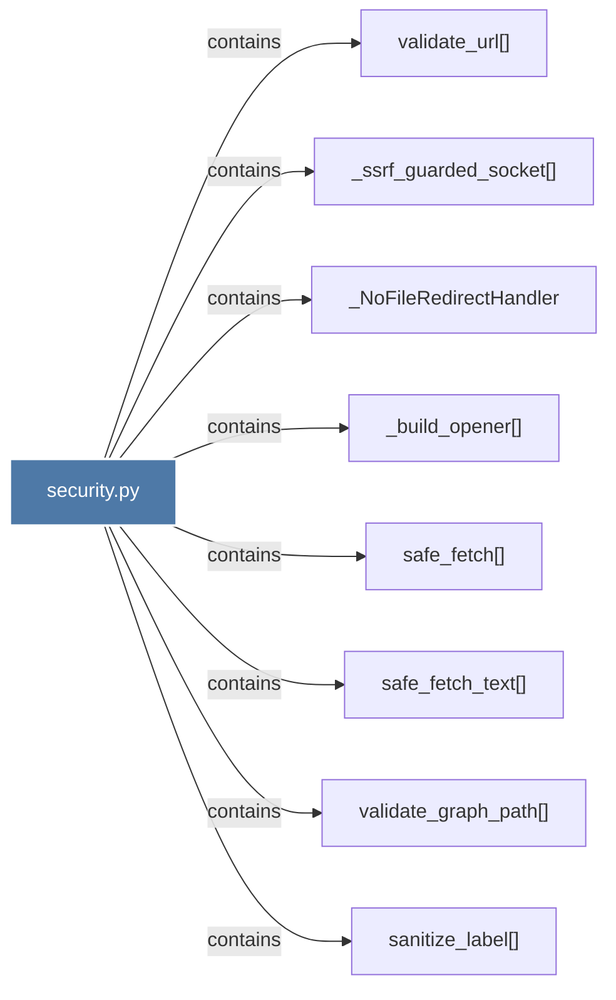

# security.py

> [!info] Properties
> **File Type**: code
> **Community**: [[_COMMUNITY_Community None|Community None]]
> **Degree**: 8

## Architecture Graph


## Outbound Connections
- [[_NoFileRedirectHandler]] - `contains` [EXTRACTED]
- [[_build_opener()]] - `contains` [EXTRACTED]
- [[_ssrf_guarded_socket()]] - `contains` [EXTRACTED]
- [[safe_fetch()]] - `contains` [EXTRACTED]
- [[safe_fetch_text()]] - `contains` [EXTRACTED]
- [[sanitize_label()]] - `contains` [EXTRACTED]
- [[validate_graph_path()]] - `contains` [EXTRACTED]
- [[validate_url()]] - `contains` [EXTRACTED]

## Inbound Dependencies
> [!abstract]- Files that link here
```dataview
LIST
FROM [[security.py]]
```

#graphify/code #graphify/EXTRACTED #community/Community_None