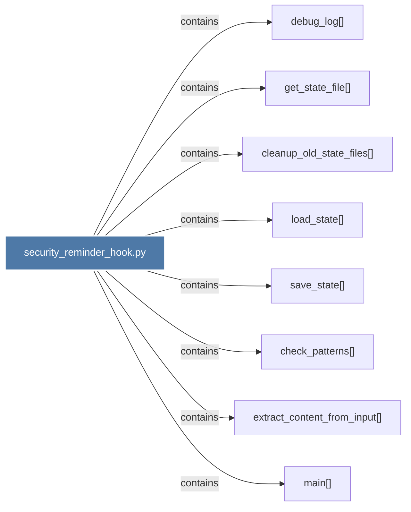

# security_reminder_hook.py

> [!info] Properties
> **File Type**: code
> **Community**: [[_COMMUNITY_Community None|Community None]]
> **Degree**: 8

## Architecture Graph


## Outbound Connections
- [[check_patterns()]] - `contains` [EXTRACTED]
- [[cleanup_old_state_files()]] - `contains` [EXTRACTED]
- [[debug_log()]] - `contains` [EXTRACTED]
- [[extract_content_from_input()]] - `contains` [EXTRACTED]
- [[get_state_file()]] - `contains` [EXTRACTED]
- [[load_state()]] - `contains` [EXTRACTED]
- [[main()_8]] - `contains` [EXTRACTED]
- [[save_state()]] - `contains` [EXTRACTED]

## Inbound Dependencies
> [!abstract]- Files that link here
```dataview
LIST
FROM [[security_reminder_hook.py]]
```

#graphify/code #graphify/EXTRACTED #community/Community_None