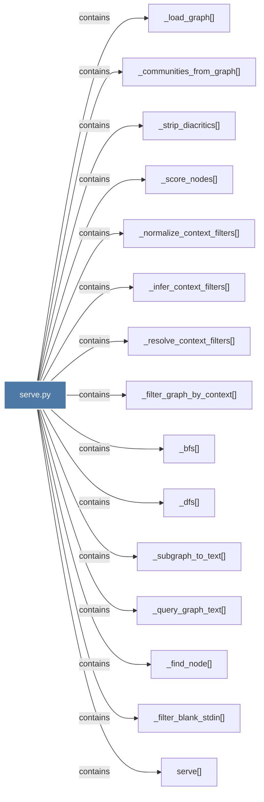

# serve.py

> [!info] Properties
> **File Type**: code
> **Community**: [[_COMMUNITY_Community None|Community None]]
> **Degree**: 15

## Architecture Graph


## Outbound Connections
- [[_bfs()]] - `contains` [EXTRACTED]
- [[_communities_from_graph()]] - `contains` [EXTRACTED]
- [[_dfs()]] - `contains` [EXTRACTED]
- [[_filter_blank_stdin()]] - `contains` [EXTRACTED]
- [[_filter_graph_by_context()]] - `contains` [EXTRACTED]
- [[_find_node()]] - `contains` [EXTRACTED]
- [[_infer_context_filters()]] - `contains` [EXTRACTED]
- [[_load_graph()]] - `contains` [EXTRACTED]
- [[_normalize_context_filters()]] - `contains` [EXTRACTED]
- [[_query_graph_text()]] - `contains` [EXTRACTED]
- [[_resolve_context_filters()]] - `contains` [EXTRACTED]
- [[_score_nodes()]] - `contains` [EXTRACTED]
- [[_strip_diacritics()_1]] - `contains` [EXTRACTED]
- [[_subgraph_to_text()]] - `contains` [EXTRACTED]
- [[serve()]] - `contains` [EXTRACTED]

## Inbound Dependencies
> [!abstract]- Files that link here
```dataview
LIST
FROM [[serve.py]]
```

#graphify/code #graphify/EXTRACTED #community/Community_None