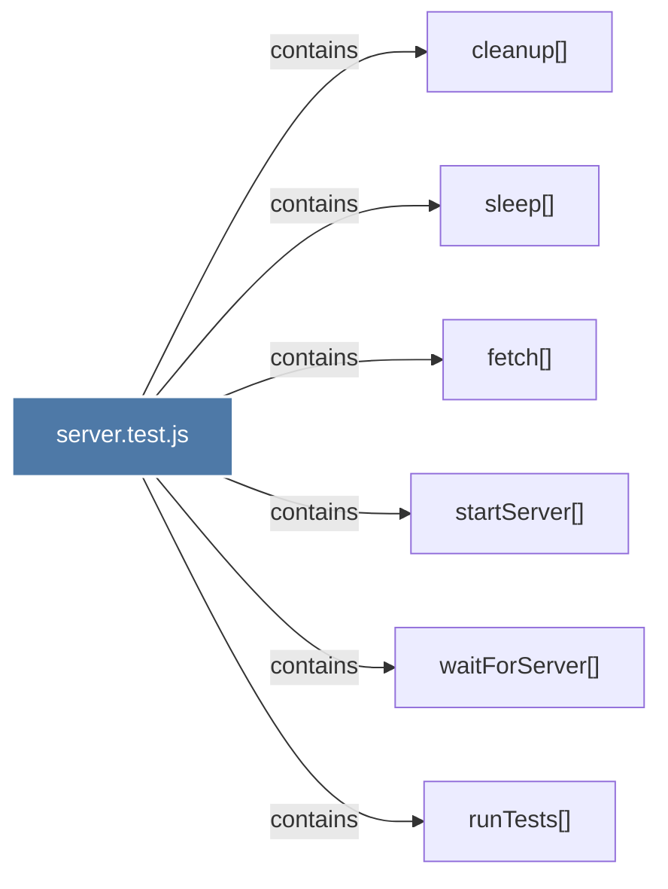

# server.test.js

> [!info] Properties
> **File Type**: code
> **Community**: [[_COMMUNITY_Community None|Community None]]
> **Degree**: 6

## Architecture Graph


## Outbound Connections
- [[cleanup()]] - `contains` [EXTRACTED]
- [[fetch()]] - `contains` [EXTRACTED]
- [[runTests()_1]] - `contains` [EXTRACTED]
- [[sleep()]] - `contains` [EXTRACTED]
- [[startServer()]] - `contains` [EXTRACTED]
- [[waitForServer()]] - `contains` [EXTRACTED]

## Inbound Dependencies
> [!abstract]- Files that link here
```dataview
LIST
FROM [[server.test.js]]
```

#graphify/code #graphify/EXTRACTED #community/Community_None