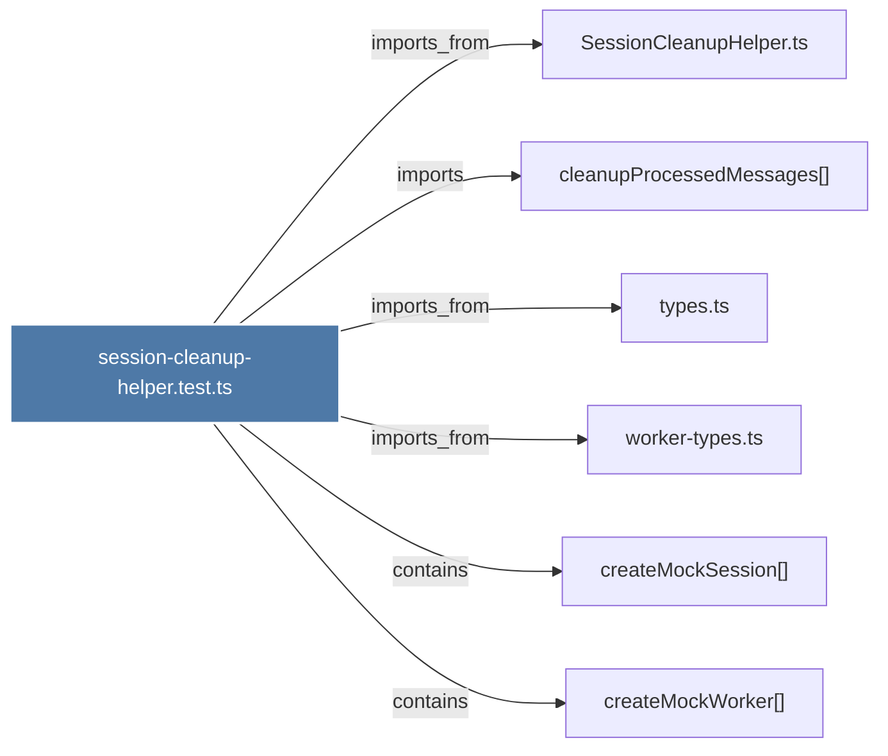

# session-cleanup-helper.test.ts

> [!info] Properties
> **File Type**: code
> **Community**: [[_COMMUNITY_Community None|Community None]]
> **Degree**: 6

## Architecture Graph


## Outbound Connections
- [[SessionCleanupHelper.ts]] - `imports_from` [EXTRACTED]
- [[cleanupProcessedMessages()]] - `imports` [EXTRACTED]
- [[createMockSession()_1]] - `contains` [EXTRACTED]
- [[createMockWorker()]] - `contains` [EXTRACTED]
- [[types.ts_1]] - `imports_from` [EXTRACTED]
- [[worker-types.ts]] - `imports_from` [EXTRACTED]

## Inbound Dependencies
> [!abstract]- Files that link here
```dataview
LIST
FROM [[session-cleanup-helper.test.ts]]
```

#graphify/code #graphify/EXTRACTED #community/Community_None