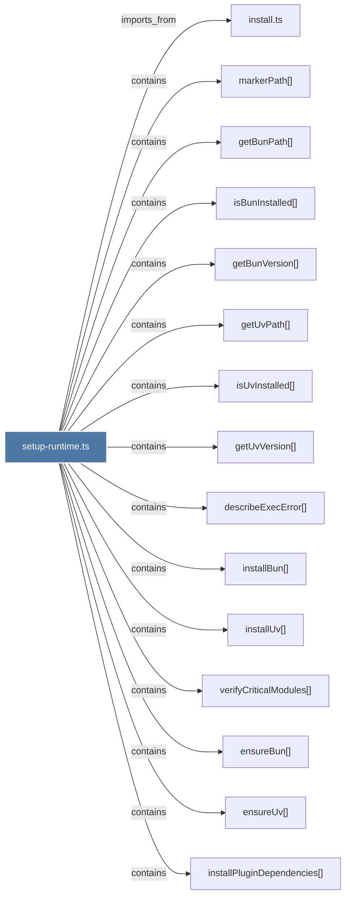

# setup-runtime.ts

> [!info] Properties
> **File Type**: code
> **Community**: [[_COMMUNITY_Community None|Community None]]
> **Degree**: 18

## Architecture Graph


## Outbound Connections
- [[describeExecError()]] - `contains` [EXTRACTED]
- [[ensureBun()]] - `contains` [EXTRACTED]
- [[ensureUv()]] - `contains` [EXTRACTED]
- [[getBunPath()]] - `contains` [EXTRACTED]
- [[getBunVersion()]] - `contains` [EXTRACTED]
- [[getUvPath()]] - `contains` [EXTRACTED]
- [[getUvVersion()]] - `contains` [EXTRACTED]
- [[install.ts]] - `imports_from` [EXTRACTED]
- [[installBun()]] - `contains` [EXTRACTED]
- [[installPluginDependencies()]] - `contains` [EXTRACTED]
- [[installUv()]] - `contains` [EXTRACTED]
- [[isBunInstalled()]] - `contains` [EXTRACTED]
- [[isInstallCurrent()]] - `contains` [EXTRACTED]
- [[isUvInstalled()]] - `contains` [EXTRACTED]
- [[markerPath()]] - `contains` [EXTRACTED]
- [[readInstallMarker()]] - `contains` [EXTRACTED]
- [[verifyCriticalModules()]] - `contains` [EXTRACTED]
- [[writeInstallMarker()]] - `contains` [EXTRACTED]

## Inbound Dependencies
> [!abstract]- Files that link here
```dataview
LIST
FROM [[setup-runtime.ts]]
```

#graphify/code #graphify/EXTRACTED #community/Community_None