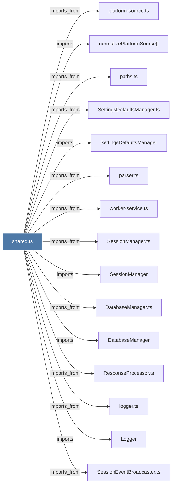

# shared.ts

> [!info] Properties
> **File Type**: code
> **Community**: [[_COMMUNITY_Community None|Community None]]
> **Degree**: 33

## Architecture Graph


## Outbound Connections
- [[DatabaseManager]] - `imports` [EXTRACTED]
- [[DatabaseManager.ts]] - `imports_from` [EXTRACTED]
- [[IngestEventBus]] - `contains` [EXTRACTED]
- [[Logger]] - `imports` [EXTRACTED]
- [[PrivacyCheckValidator]] - `imports` [EXTRACTED]
- [[PrivacyCheckValidator.ts]] - `imports_from` [EXTRACTED]
- [[ResponseProcessor.ts]] - `imports_from` [EXTRACTED]
- [[SessionEventBroadcaster]] - `imports` [EXTRACTED]
- [[SessionEventBroadcaster.ts]] - `imports_from` [EXTRACTED]
- [[SessionManager]] - `imports` [EXTRACTED]
- [[SessionManager.ts]] - `imports_from` [EXTRACTED]
- [[SessionRoutes.ts]] - `imports_from` [EXTRACTED]
- [[SettingsDefaultsManager]] - `imports` [EXTRACTED]
- [[SettingsDefaultsManager.ts]] - `imports_from` [EXTRACTED]
- [[attachIngestGeneratorStarter()]] - `contains` [EXTRACTED]
- [[getProjectContext()]] - `imports` [EXTRACTED]
- [[ingestObservation()]] - `contains` [EXTRACTED]
- [[ingestPrompt()]] - `contains` [EXTRACTED]
- [[ingestSummary()]] - `contains` [EXTRACTED]
- [[isProjectExcluded()]] - `imports` [EXTRACTED]
- [[logger.ts]] - `imports_from` [EXTRACTED]
- [[normalizePlatformSource()]] - `imports` [EXTRACTED]
- [[parser.ts]] - `imports_from` [EXTRACTED]
- [[paths.ts]] - `imports_from` [EXTRACTED]
- [[platform-source.ts]] - `imports_from` [EXTRACTED]
- [[processor.ts]] - `imports_from` [EXTRACTED]
- [[project-filter.ts]] - `imports_from` [EXTRACTED]
- [[project-name.ts]] - `imports_from` [EXTRACTED]
- [[requireContext()]] - `contains` [EXTRACTED]
- [[setIngestContext()]] - `contains` [EXTRACTED]
- [[stripMemoryTagsFromJson()]] - `imports` [EXTRACTED]
- [[tag-stripping.ts]] - `imports_from` [EXTRACTED]
- [[worker-service.ts]] - `imports_from` [EXTRACTED]

## Inbound Dependencies
> [!abstract]- Files that link here
```dataview
LIST
FROM [[shared.ts]]
```

#graphify/code #graphify/EXTRACTED #community/Community_None