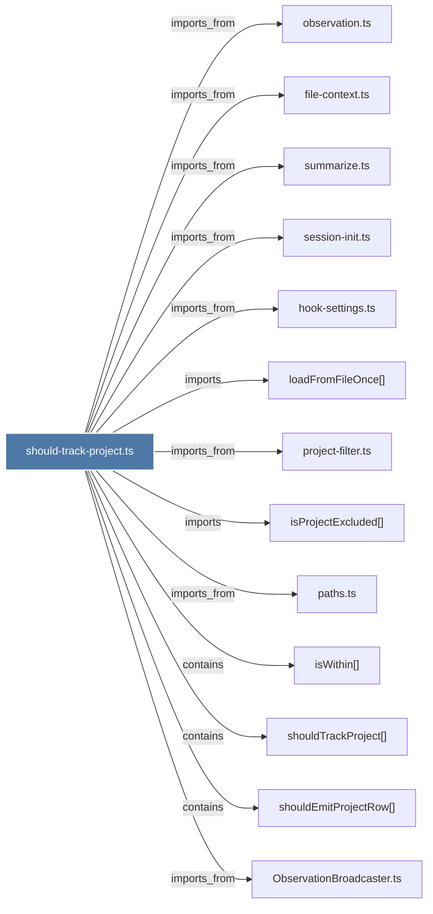

# should-track-project.ts

> [!info] Properties
> **File Type**: code
> **Community**: [[_COMMUNITY_Community None|Community None]]
> **Degree**: 13

## Architecture Graph


## Outbound Connections
- [[ObservationBroadcaster.ts]] - `imports_from` [EXTRACTED]
- [[file-context.ts]] - `imports_from` [EXTRACTED]
- [[hook-settings.ts]] - `imports_from` [EXTRACTED]
- [[isProjectExcluded()]] - `imports` [EXTRACTED]
- [[isWithin()]] - `contains` [EXTRACTED]
- [[loadFromFileOnce()]] - `imports` [EXTRACTED]
- [[observation.ts]] - `imports_from` [EXTRACTED]
- [[paths.ts]] - `imports_from` [EXTRACTED]
- [[project-filter.ts]] - `imports_from` [EXTRACTED]
- [[session-init.ts]] - `imports_from` [EXTRACTED]
- [[shouldEmitProjectRow()]] - `contains` [EXTRACTED]
- [[shouldTrackProject()]] - `contains` [EXTRACTED]
- [[summarize.ts]] - `imports_from` [EXTRACTED]

## Inbound Dependencies
> [!abstract]- Files that link here
```dataview
LIST
FROM [[should-track-project.ts]]
```

#graphify/code #graphify/EXTRACTED #community/Community_None