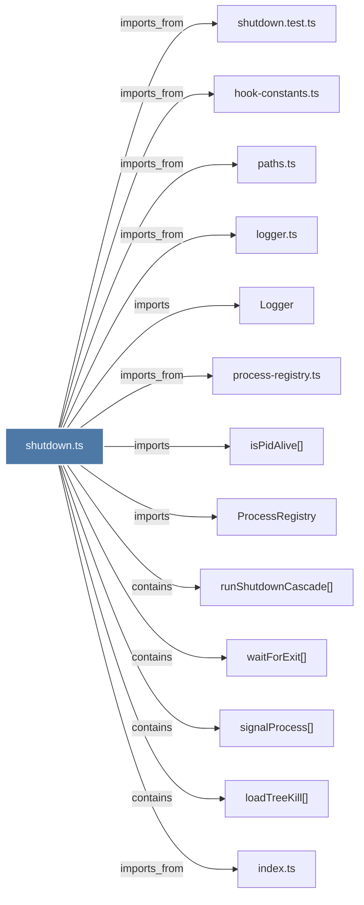

# shutdown.ts

> [!info] Properties
> **File Type**: code
> **Community**: [[_COMMUNITY_Community None|Community None]]
> **Degree**: 13

## Architecture Graph


## Outbound Connections
- [[Logger]] - `imports` [EXTRACTED]
- [[ProcessRegistry]] - `imports` [EXTRACTED]
- [[hook-constants.ts]] - `imports_from` [EXTRACTED]
- [[index.ts_11]] - `imports_from` [EXTRACTED]
- [[isPidAlive()]] - `imports` [EXTRACTED]
- [[loadTreeKill()]] - `contains` [EXTRACTED]
- [[logger.ts]] - `imports_from` [EXTRACTED]
- [[paths.ts]] - `imports_from` [EXTRACTED]
- [[process-registry.ts]] - `imports_from` [EXTRACTED]
- [[runShutdownCascade()]] - `contains` [EXTRACTED]
- [[shutdown.test.ts]] - `imports_from` [EXTRACTED]
- [[signalProcess()]] - `contains` [EXTRACTED]
- [[waitForExit()]] - `contains` [EXTRACTED]

## Inbound Dependencies
> [!abstract]- Files that link here
```dataview
LIST
FROM [[shutdown.ts]]
```

#graphify/code #graphify/EXTRACTED #community/Community_None