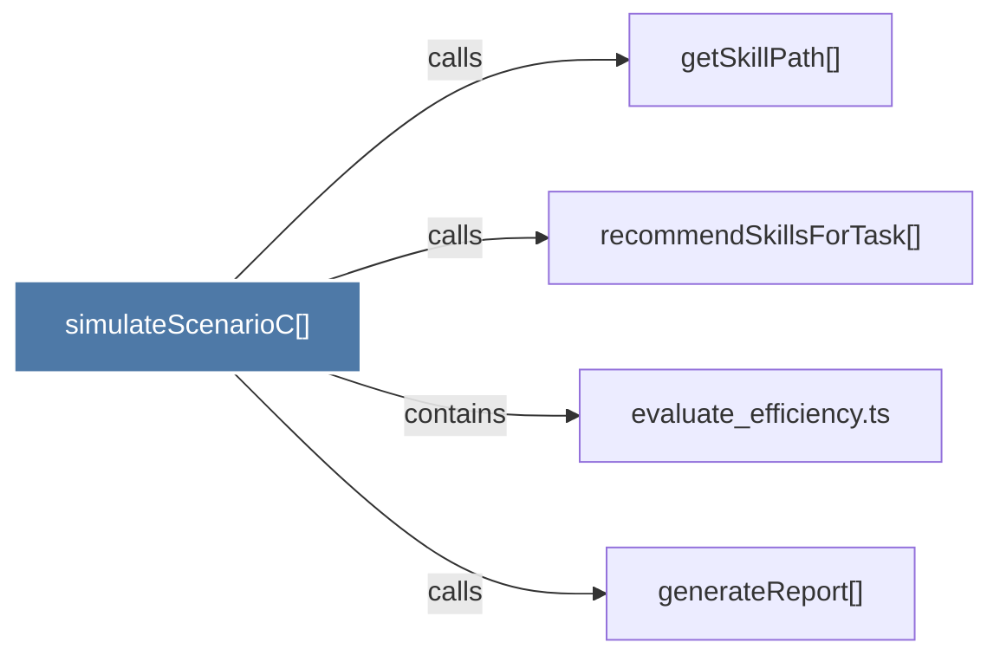

# simulateScenarioC()

> [!info] Properties
> **File Type**: code
> **Community**: [[_COMMUNITY_Community None|Community None]]
> **Degree**: 4

## Architecture Graph


## Outbound Connections
- [[evaluate_efficiency.ts]] - `contains` [EXTRACTED]
- [[generateReport()_1]] - `calls` [EXTRACTED]
- [[getSkillPath()]] - `calls` [INFERRED]
- [[recommendSkillsForTask()]] - `calls` [INFERRED]

## Inbound Dependencies
> [!abstract]- Files that link here
```dataview
LIST
FROM [[simulateScenarioC()]]
```

#graphify/code #graphify/INFERRED #community/Community_None