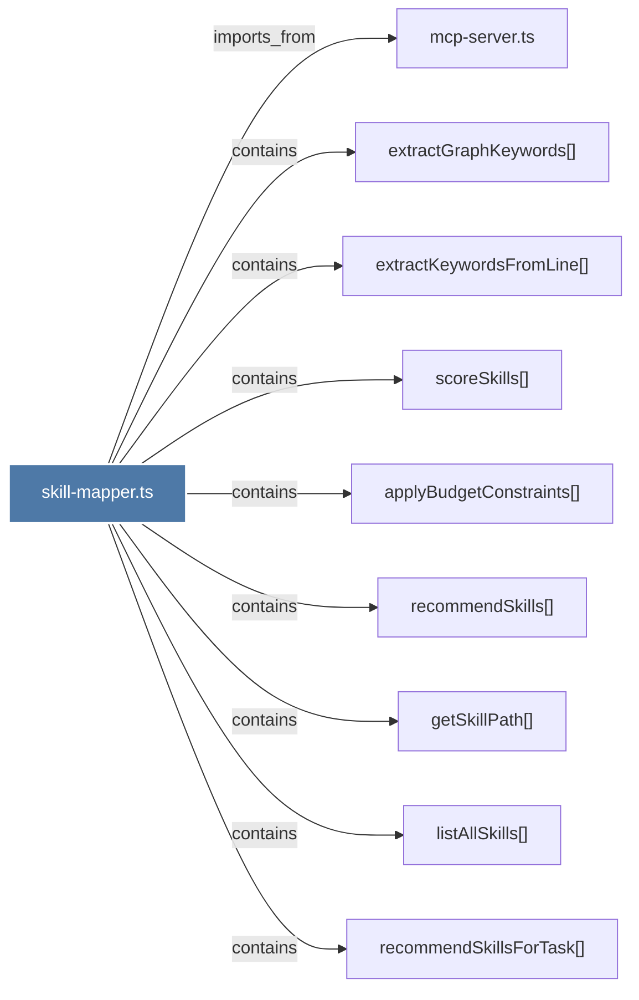

# skill-mapper.ts

> [!info] Properties
> **File Type**: code
> **Community**: [[_COMMUNITY_Community None|Community None]]
> **Degree**: 9

## Architecture Graph


## Outbound Connections
- [[applyBudgetConstraints()]] - `contains` [EXTRACTED]
- [[extractGraphKeywords()]] - `contains` [EXTRACTED]
- [[extractKeywordsFromLine()]] - `contains` [EXTRACTED]
- [[getSkillPath()]] - `contains` [EXTRACTED]
- [[listAllSkills()]] - `contains` [EXTRACTED]
- [[mcp-server.ts_1]] - `imports_from` [EXTRACTED]
- [[recommendSkills()]] - `contains` [EXTRACTED]
- [[recommendSkillsForTask()]] - `contains` [EXTRACTED]
- [[scoreSkills()]] - `contains` [EXTRACTED]

## Inbound Dependencies
> [!abstract]- Files that link here
```dataview
LIST
FROM [[skill-mapper.ts]]
```

#graphify/code #graphify/EXTRACTED #community/Community_None