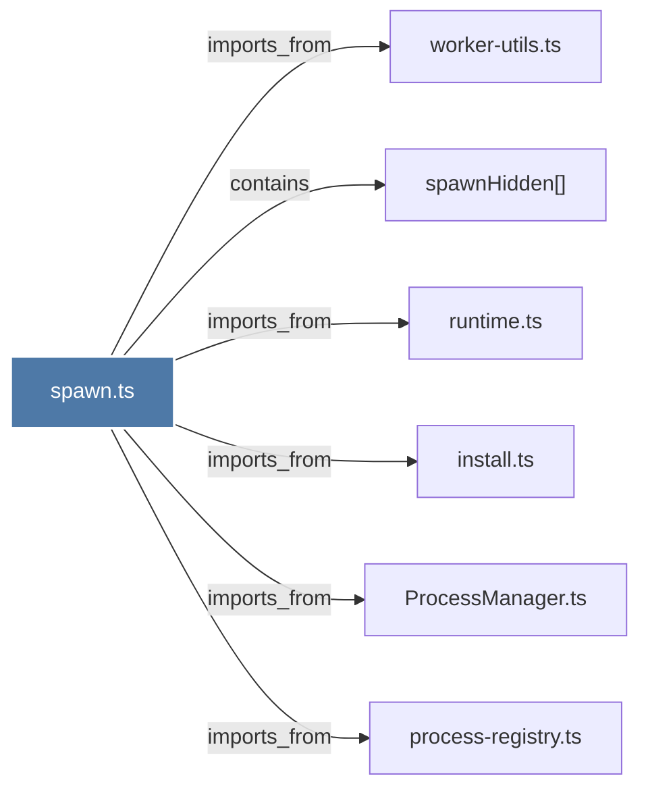

# spawn.ts

> [!info] Properties
> **File Type**: code
> **Community**: [[_COMMUNITY_Community None|Community None]]
> **Degree**: 6

## Architecture Graph


## Outbound Connections
- [[ProcessManager.ts]] - `imports_from` [EXTRACTED]
- [[install.ts]] - `imports_from` [EXTRACTED]
- [[process-registry.ts]] - `imports_from` [EXTRACTED]
- [[runtime.ts]] - `imports_from` [EXTRACTED]
- [[spawnHidden()]] - `contains` [EXTRACTED]
- [[worker-utils.ts]] - `imports_from` [EXTRACTED]

## Inbound Dependencies
> [!abstract]- Files that link here
```dataview
LIST
FROM [[spawn.ts]]
```

#graphify/code #graphify/EXTRACTED #community/Community_None