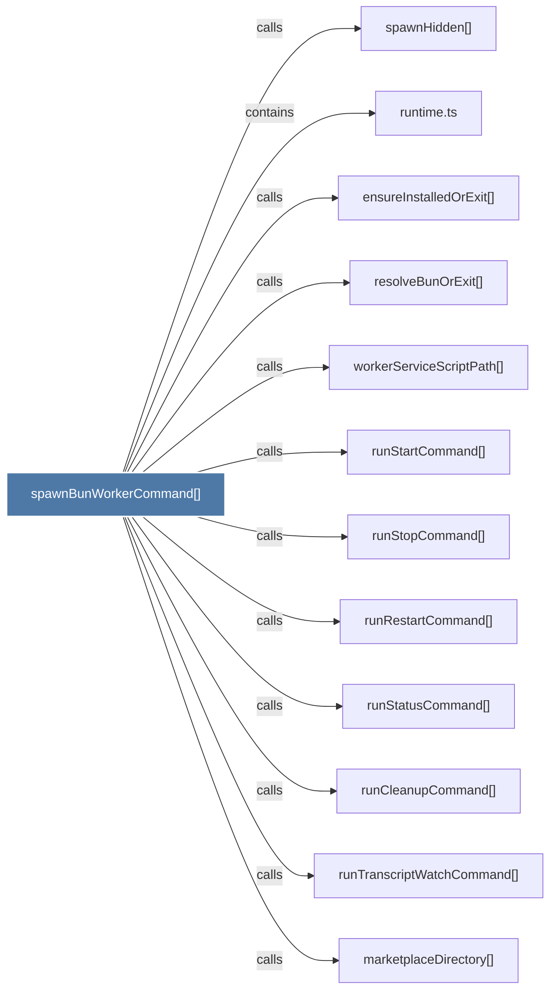

# spawnBunWorkerCommand()

> [!info] Properties
> **File Type**: code
> **Community**: [[_COMMUNITY_Community None|Community None]]
> **Degree**: 12

## Architecture Graph


## Outbound Connections
- [[ensureInstalledOrExit()]] - `calls` [EXTRACTED]
- [[marketplaceDirectory()]] - `calls` [INFERRED]
- [[resolveBunOrExit()]] - `calls` [EXTRACTED]
- [[runCleanupCommand()]] - `calls` [EXTRACTED]
- [[runRestartCommand()]] - `calls` [EXTRACTED]
- [[runStartCommand()]] - `calls` [EXTRACTED]
- [[runStatusCommand()]] - `calls` [EXTRACTED]
- [[runStopCommand()]] - `calls` [EXTRACTED]
- [[runTranscriptWatchCommand()]] - `calls` [EXTRACTED]
- [[runtime.ts]] - `contains` [EXTRACTED]
- [[spawnHidden()]] - `calls` [INFERRED]
- [[workerServiceScriptPath()]] - `calls` [EXTRACTED]

## Inbound Dependencies
> [!abstract]- Files that link here
```dataview
LIST
FROM [[spawnBunWorkerCommand()]]
```

#graphify/code #graphify/EXTRACTED #community/Community_None