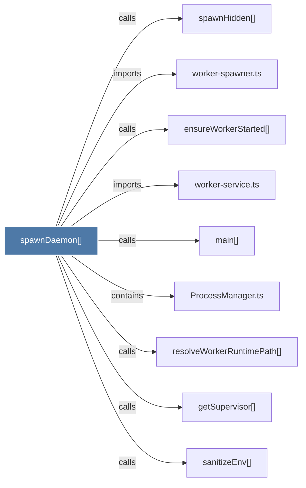

# spawnDaemon()

> [!info] Properties
> **File Type**: code
> **Community**: [[_COMMUNITY_Community None|Community None]]
> **Degree**: 9

## Architecture Graph


## Outbound Connections
- [[ProcessManager.ts]] - `contains` [EXTRACTED]
- [[ensureWorkerStarted()]] - `calls` [INFERRED]
- [[getSupervisor()]] - `calls` [INFERRED]
- [[main()_22]] - `calls` [INFERRED]
- [[resolveWorkerRuntimePath()]] - `calls` [EXTRACTED]
- [[sanitizeEnv()]] - `calls` [INFERRED]
- [[spawnHidden()]] - `calls` [INFERRED]
- [[worker-service.ts]] - `imports` [EXTRACTED]
- [[worker-spawner.ts]] - `imports` [EXTRACTED]

## Inbound Dependencies
> [!abstract]- Files that link here
```dataview
LIST
FROM [[spawnDaemon()]]
```

#graphify/code #graphify/INFERRED #community/Community_None