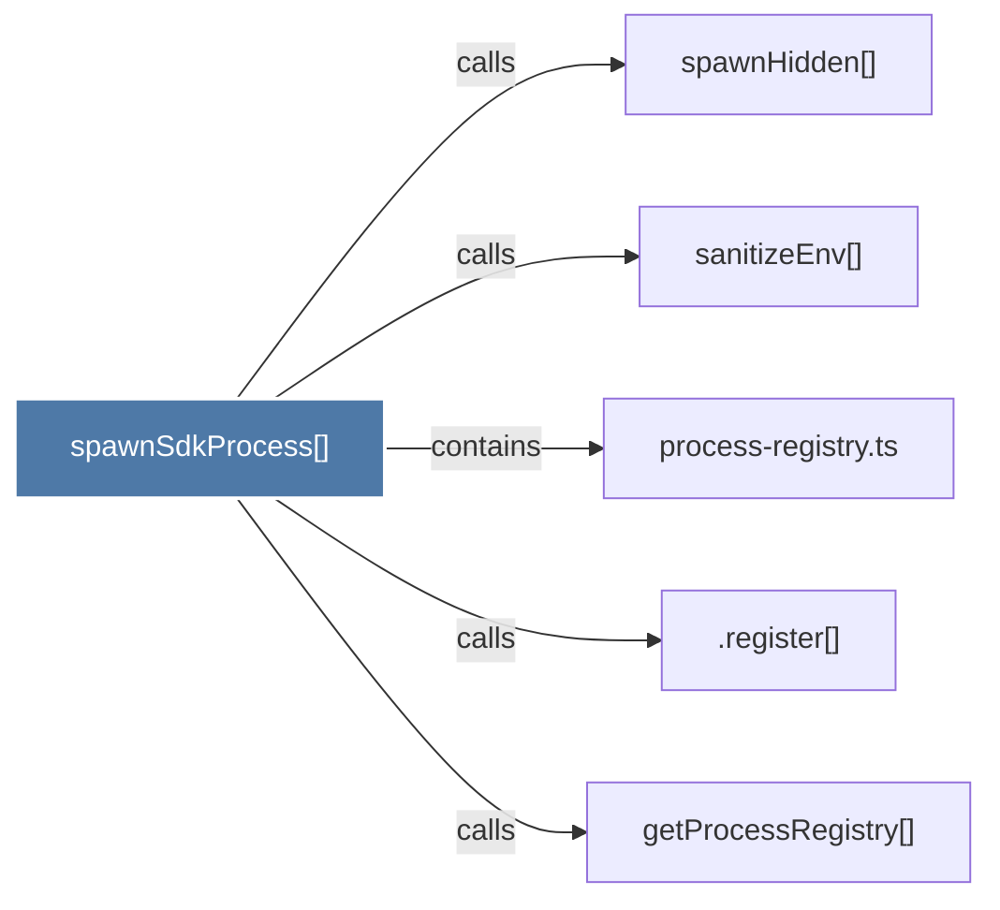

# spawnSdkProcess()

> [!info] Properties
> **File Type**: code
> **Community**: [[_COMMUNITY_Community None|Community None]]
> **Degree**: 5

## Architecture Graph


## Outbound Connections
- [[.register()_1]] - `calls` [EXTRACTED]
- [[getProcessRegistry()]] - `calls` [EXTRACTED]
- [[process-registry.ts]] - `contains` [EXTRACTED]
- [[sanitizeEnv()]] - `calls` [INFERRED]
- [[spawnHidden()]] - `calls` [INFERRED]

## Inbound Dependencies
> [!abstract]- Files that link here
```dataview
LIST
FROM [[spawnSdkProcess()]]
```

#graphify/code #graphify/EXTRACTED #community/Community_None