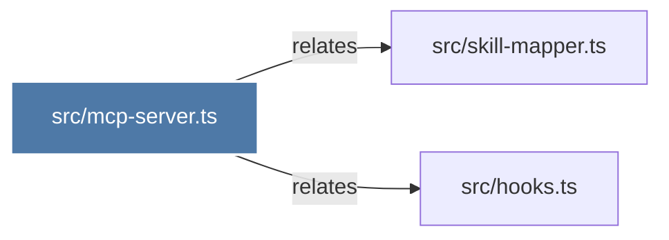

# src/mcp-server.ts

> [!info] Properties
> **File Type**: unknown
> **Community**: [[_COMMUNITY_Community None|Community None]]
> **Degree**: 2

## Architecture Graph


## Outbound Connections
- [[srchooks.ts]] - `` [EXTRACTED]
- [[srcskill-mapper.ts]] - `` [EXTRACTED]

## Inbound Dependencies
> [!abstract]- Files that link here
```dataview
LIST
FROM [[srcmcp-server.ts]]
```

#graphify/document #graphify/EXTRACTED #community/Community_None