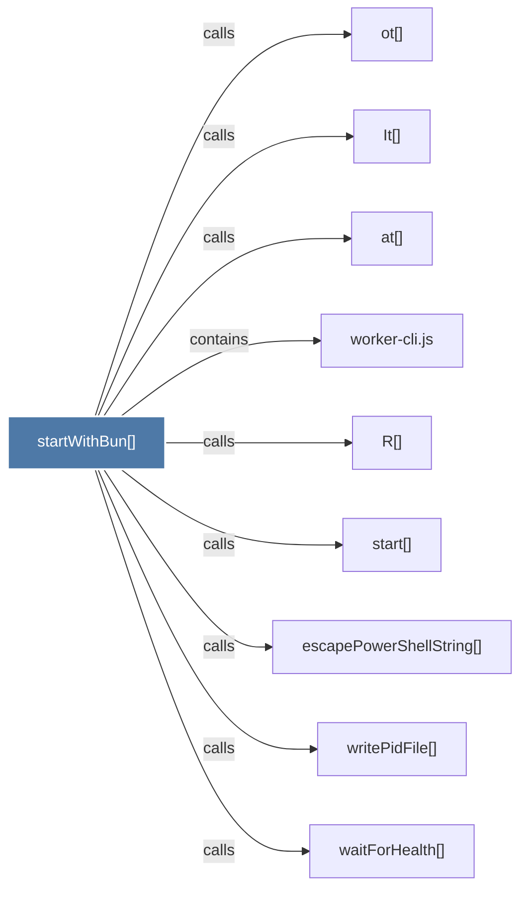

# startWithBun()

> [!info] Properties
> **File Type**: code
> **Community**: [[_COMMUNITY_Community None|Community None]]
> **Degree**: 9

## Architecture Graph


## Outbound Connections
- [[It()]] - `calls` [INFERRED]
- [[R()]] - `calls` [EXTRACTED]
- [[at()]] - `calls` [INFERRED]
- [[escapePowerShellString()]] - `calls` [EXTRACTED]
- [[ot()]] - `calls` [INFERRED]
- [[start()]] - `calls` [EXTRACTED]
- [[waitForHealth()_2]] - `calls` [EXTRACTED]
- [[worker-cli.js]] - `contains` [EXTRACTED]
- [[writePidFile()_1]] - `calls` [EXTRACTED]

## Inbound Dependencies
> [!abstract]- Files that link here
```dataview
LIST
FROM [[startWithBun()]]
```

#graphify/code #graphify/EXTRACTED #community/Community_None