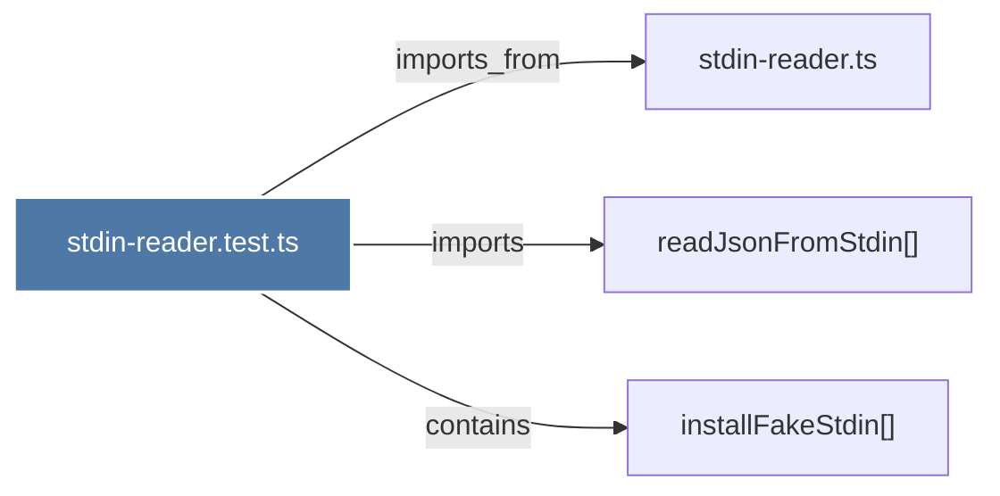

# stdin-reader.test.ts

> [!info] Properties
> **File Type**: code
> **Community**: [[_COMMUNITY_Community None|Community None]]
> **Degree**: 3

## Architecture Graph


## Outbound Connections
- [[installFakeStdin()]] - `contains` [EXTRACTED]
- [[readJsonFromStdin()]] - `imports` [EXTRACTED]
- [[stdin-reader.ts]] - `imports_from` [EXTRACTED]

## Inbound Dependencies
> [!abstract]- Files that link here
```dataview
LIST
FROM [[stdin-reader.test.ts]]
```

#graphify/code #graphify/EXTRACTED #community/Community_None