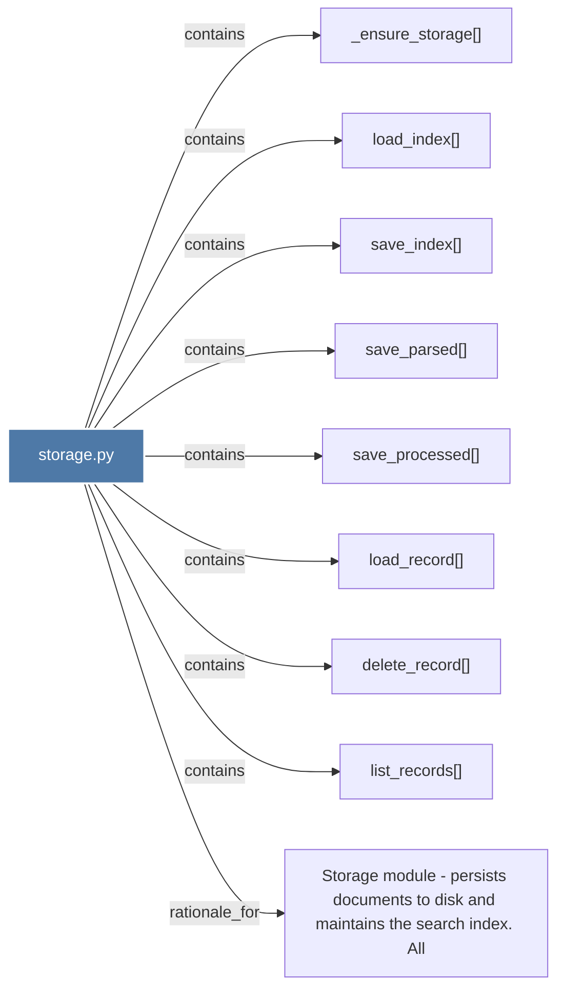

# storage.py

> [!info] Properties
> **File Type**: code
> **Community**: [[_COMMUNITY_Community None|Community None]]
> **Degree**: 9

## Architecture Graph


## Outbound Connections
- [[Storage module - persists documents to disk and maintains the search index. All]] - `rationale_for` [EXTRACTED]
- [[_ensure_storage()]] - `contains` [EXTRACTED]
- [[delete_record()]] - `contains` [EXTRACTED]
- [[list_records()]] - `contains` [EXTRACTED]
- [[load_index()]] - `contains` [EXTRACTED]
- [[load_record()]] - `contains` [EXTRACTED]
- [[save_index()]] - `contains` [EXTRACTED]
- [[save_parsed()]] - `contains` [EXTRACTED]
- [[save_processed()]] - `contains` [EXTRACTED]

## Inbound Dependencies
> [!abstract]- Files that link here
```dataview
LIST
FROM [[storage.py]]
```

#graphify/code #graphify/EXTRACTED #community/Community_None