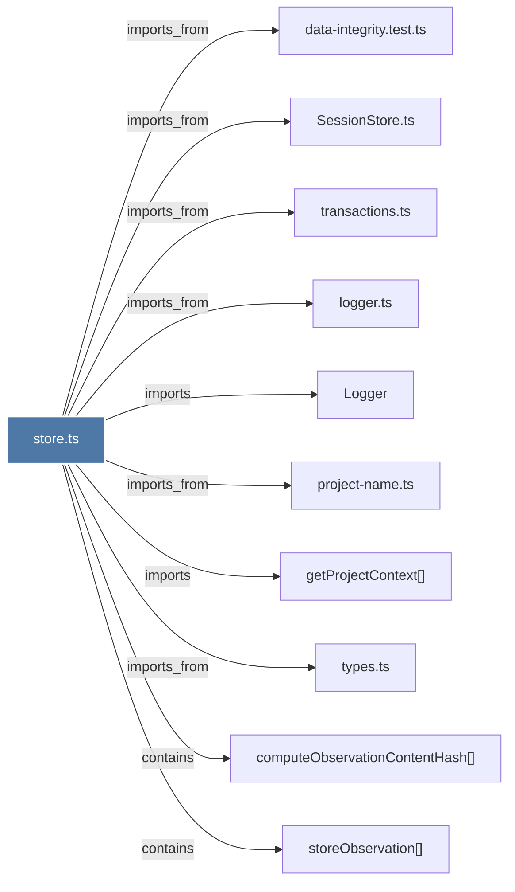

# store.ts

> [!info] Properties
> **File Type**: code
> **Community**: [[_COMMUNITY_Community None|Community None]]
> **Degree**: 10

## Architecture Graph


## Outbound Connections
- [[Logger]] - `imports` [EXTRACTED]
- [[SessionStore.ts]] - `imports_from` [EXTRACTED]
- [[computeObservationContentHash()]] - `contains` [EXTRACTED]
- [[data-integrity.test.ts]] - `imports_from` [EXTRACTED]
- [[getProjectContext()]] - `imports` [EXTRACTED]
- [[logger.ts]] - `imports_from` [EXTRACTED]
- [[project-name.ts]] - `imports_from` [EXTRACTED]
- [[storeObservation()]] - `contains` [EXTRACTED]
- [[transactions.ts]] - `imports_from` [EXTRACTED]
- [[types.ts_7]] - `imports_from` [EXTRACTED]

## Inbound Dependencies
> [!abstract]- Files that link here
```dataview
LIST
FROM [[store.ts]]
```

#graphify/code #graphify/EXTRACTED #community/Community_None