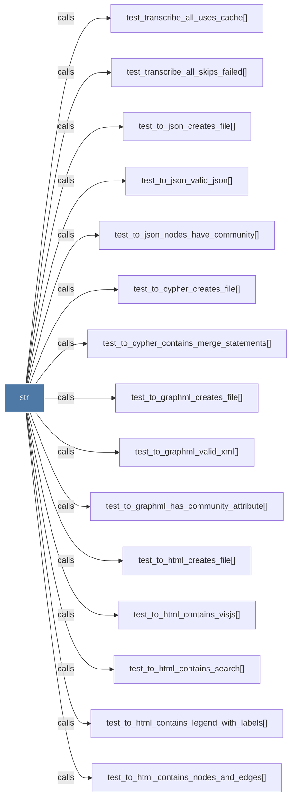

# str

> [!info] Properties
> **File Type**: code
> **Community**: [[_COMMUNITY_Community None|Community None]]
> **Degree**: 126

## Architecture Graph


## Outbound Connections
- [[._build_credentials()]] - `calls` [INFERRED]
- [[._extract_field()]] - `calls` [INFERRED]
- [[.handle_request()_1]] - `calls` [INFERRED]
- [[.run_cmd()]] - `calls` [INFERRED]
- [[.test_install_reconfigures_missing_statusline()]] - `calls` [INFERRED]
- [[.test_install_upgrades_old_two_file_install()]] - `calls` [INFERRED]
- [[FileType]] - `inherits` [EXTRACTED]
- [[_clone_repo()]] - `calls` [INFERRED]
- [[_common_root()]] - `calls` [INFERRED]
- [[_could_contain_included_path()]] - `calls` [EXTRACTED]
- [[_cpp_preprocess()]] - `calls` [INFERRED]
- [[_dynamic_import_js()]] - `calls` [INFERRED]
- [[_extract_generic()]] - `calls` [INFERRED]
- [[_extract_parallel()]] - `calls` [INFERRED]
- [[_extract_python_rationale()]] - `calls` [INFERRED]
- [[_hooks_dir()]] - `calls` [INFERRED]
- [[_import_js()]] - `calls` [INFERRED]
- [[_import_lua()]] - `calls` [INFERRED]
- [[_import_python()]] - `calls` [INFERRED]
- [[_install_claude_hook()]] - `calls` [INFERRED]
- [[_install_codex_hook()]] - `calls` [INFERRED]
- [[_install_gemini_hook()]] - `calls` [INFERRED]
- [[_is_ignored()]] - `calls` [EXTRACTED]
- [[_is_included()]] - `calls` [EXTRACTED]
- [[_kiro_uninstall()]] - `calls` [INFERRED]
- [[_load_tsconfig_aliases()]] - `calls` [INFERRED]
- [[_make_git_repo()]] - `calls` [INFERRED]
- [[_make_graph()_3]] - `calls` [INFERRED]
- [[_normalize_context_filters()]] - `calls` [INFERRED]
- [[_normalize_path()]] - `calls` [INFERRED]
- [[_read_tsconfig_aliases()]] - `calls` [INFERRED]
- [[_rebuild_code()]] - `calls` [INFERRED]
- [[_relativize_source_files()]] - `calls` [INFERRED]
- [[_report_root_label()]] - `calls` [INFERRED]
- [[_resolve_cross_file_imports()]] - `calls` [INFERRED]
- [[_resolve_cross_file_java_imports()]] - `calls` [INFERRED]
- [[_resolve_graphify_exe()]] - `calls` [INFERRED]
- [[_uninstall_claude_hook()]] - `calls` [INFERRED]
- [[_uninstall_codex_hook()]] - `calls` [INFERRED]
- [[_uninstall_gemini_hook()]] - `calls` [INFERRED]
- [[batch_parse()]] - `calls` [INFERRED]
- [[build_tree()]] - `calls` [INFERRED]
- [[convert_office_file()]] - `calls` [EXTRACTED]
- [[detect()]] - `calls` [EXTRACTED]
- [[docx_to_markdown()]] - `calls` [EXTRACTED]
- [[download_audio()]] - `calls` [INFERRED]
- [[extract()]] - `calls` [INFERRED]
- [[extract_blade()]] - `calls` [INFERRED]
- [[extract_dart()]] - `calls` [INFERRED]
- [[extract_elixir()]] - `calls` [INFERRED]
- [[extract_fortran()]] - `calls` [INFERRED]
- [[extract_go()]] - `calls` [INFERRED]
- [[extract_julia()]] - `calls` [INFERRED]
- [[extract_objc()]] - `calls` [INFERRED]
- [[extract_pdf_text()]] - `calls` [EXTRACTED]
- [[extract_powershell()]] - `calls` [INFERRED]
- [[extract_rust()]] - `calls` [INFERRED]
- [[extract_sql()]] - `calls` [INFERRED]
- [[extract_svelte()]] - `calls` [INFERRED]
- [[extract_verilog()]] - `calls` [INFERRED]
- [[extract_zig()]] - `calls` [INFERRED]
- [[file_hash()]] - `calls` [INFERRED]
- [[handle_enrich()]] - `calls` [INFERRED]
- [[load_compress_modules()]] - `calls` [INFERRED]
- [[main()_2]] - `calls` [INFERRED]
- [[main()_4]] - `calls` [INFERRED]
- [[main()_5]] - `calls` [INFERRED]
- [[main()_6]] - `calls` [INFERRED]
- [[main()_7]] - `calls` [INFERRED]
- [[main()_26]] - `calls` [INFERRED]
- [[primitive_value_to_str()]] - `calls` [INFERRED]
- [[run_pipeline()]] - `calls` [INFERRED]
- [[sanitize_label()]] - `calls` [INFERRED]
- [[save_parsed()]] - `calls` [INFERRED]
- [[save_processed()]] - `calls` [INFERRED]
- [[shell_path()]] - `calls` [INFERRED]
- [[test_cohesion_score_complete_graph()]] - `calls` [INFERRED]
- [[test_confidence_score_round_trip()]] - `calls` [INFERRED]
- [[test_export_obsidian_custom_dir()]] - `calls` [INFERRED]
- [[test_gemini_install_writes_hook()]] - `calls` [INFERRED]
- [[test_gemini_uninstall_removes_hook()]] - `calls` [INFERRED]
- [[test_incremental_mode_detected_via_manifest()]] - `calls` [INFERRED]
- [[test_install_settings_json_idempotent()]] - `calls` [INFERRED]
- [[test_load_graph_missing_file()]] - `calls` [INFERRED]
- [[test_load_graph_roundtrip()]] - `calls` [INFERRED]
- [[test_manifest_written_after_extract()]] - `calls` [INFERRED]
- [[test_no_incremental_without_manifest()]] - `calls` [INFERRED]
- [[test_print_benchmark_no_crash()]] - `calls` [INFERRED]
- [[test_query_cli_explicit_context_filter()]] - `calls` [INFERRED]
- [[test_query_cli_heuristic_context_filter()]] - `calls` [INFERRED]
- [[test_run_benchmark_corpus_tokens_proportional()]] - `calls` [INFERRED]
- [[test_run_benchmark_error_on_empty_graph()]] - `calls` [INFERRED]
- [[test_run_benchmark_estimates_corpus_if_no_words()]] - `calls` [INFERRED]
- [[test_run_benchmark_includes_node_edge_counts()]] - `calls` [INFERRED]
- [[test_run_benchmark_per_question_list()]] - `calls` [INFERRED]
- [[test_run_benchmark_returns_reduction()]] - `calls` [INFERRED]
- [[test_to_canvas_file_paths_relative_to_vault()]] - `calls` [INFERRED]
- [[test_to_cypher_contains_merge_statements()]] - `calls` [INFERRED]
- [[test_to_cypher_creates_file()]] - `calls` [INFERRED]
- [[test_to_graphml_creates_file()]] - `calls` [INFERRED]
- [[test_to_graphml_has_community_attribute()]] - `calls` [INFERRED]
- [[test_to_graphml_valid_xml()]] - `calls` [INFERRED]
- [[test_to_html_contains_legend_with_labels()]] - `calls` [INFERRED]
- [[test_to_html_contains_nodes_and_edges()]] - `calls` [INFERRED]
- [[test_to_html_contains_search()]] - `calls` [INFERRED]
- [[test_to_html_contains_visjs()]] - `calls` [INFERRED]
- [[test_to_html_creates_file()]] - `calls` [INFERRED]
- [[test_to_html_member_counts_accepted()]] - `calls` [INFERRED]
- [[test_to_json_creates_file()]] - `calls` [INFERRED]
- [[test_to_json_defaults_missing_confidence_score()]] - `calls` [INFERRED]
- [[test_to_json_nodes_have_community()]] - `calls` [INFERRED]
- [[test_to_json_valid_json()]] - `calls` [INFERRED]
- [[test_transcribe_all_skips_failed()]] - `calls` [INFERRED]
- [[test_transcribe_all_uses_cache()]] - `calls` [INFERRED]
- [[test_uninstall_removes_settings_hook()]] - `calls` [INFERRED]
- [[test_validate_graph_path_allows_inside_base()]] - `calls` [INFERRED]
- [[test_validate_graph_path_blocks_traversal()]] - `calls` [INFERRED]
- [[test_validate_graph_path_raises_if_file_missing()]] - `calls` [INFERRED]
- [[test_validate_graph_path_requires_base_exists()]] - `calls` [INFERRED]
- [[to_html()]] - `calls` [INFERRED]
- [[transcribe()]] - `calls` [INFERRED]
- [[transcribe_all()]] - `calls` [INFERRED]
- [[validate_batch()]] - `calls` [INFERRED]
- [[watch()]] - `calls` [INFERRED]
- [[xlsx_extract_structure()]] - `calls` [EXTRACTED]
- [[xlsx_to_markdown()]] - `calls` [EXTRACTED]

## Inbound Dependencies
> [!abstract]- Files that link here
```dataview
LIST
FROM [[str]]
```

#graphify/code #graphify/INFERRED #community/Community_None