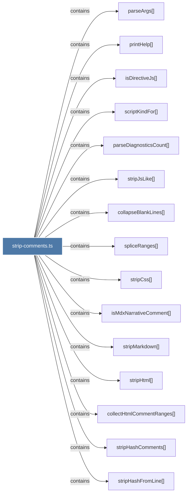

# strip-comments.ts

> [!info] Properties
> **File Type**: code
> **Community**: [[_COMMUNITY_Community None|Community None]]
> **Degree**: 17

## Architecture Graph


## Outbound Connections
- [[collapseBlankLines()]] - `contains` [EXTRACTED]
- [[collectHtmlCommentRanges()]] - `contains` [EXTRACTED]
- [[isDirectiveJs()]] - `contains` [EXTRACTED]
- [[isMdxNarrativeComment()]] - `contains` [EXTRACTED]
- [[main()_28]] - `contains` [EXTRACTED]
- [[parseArgs()_1]] - `contains` [EXTRACTED]
- [[parseDiagnosticsCount()]] - `contains` [EXTRACTED]
- [[printHelp()_1]] - `contains` [EXTRACTED]
- [[processFile()_1]] - `contains` [EXTRACTED]
- [[scriptKindFor()]] - `contains` [EXTRACTED]
- [[spliceRanges()]] - `contains` [EXTRACTED]
- [[stripCss()]] - `contains` [EXTRACTED]
- [[stripHashComments()]] - `contains` [EXTRACTED]
- [[stripHashFromLine()]] - `contains` [EXTRACTED]
- [[stripHtml()]] - `contains` [EXTRACTED]
- [[stripJsLike()]] - `contains` [EXTRACTED]
- [[stripMarkdown()]] - `contains` [EXTRACTED]

## Inbound Dependencies
> [!abstract]- Files that link here
```dataview
LIST
FROM [[strip-comments.ts]]
```

#graphify/code #graphify/EXTRACTED #community/Community_None