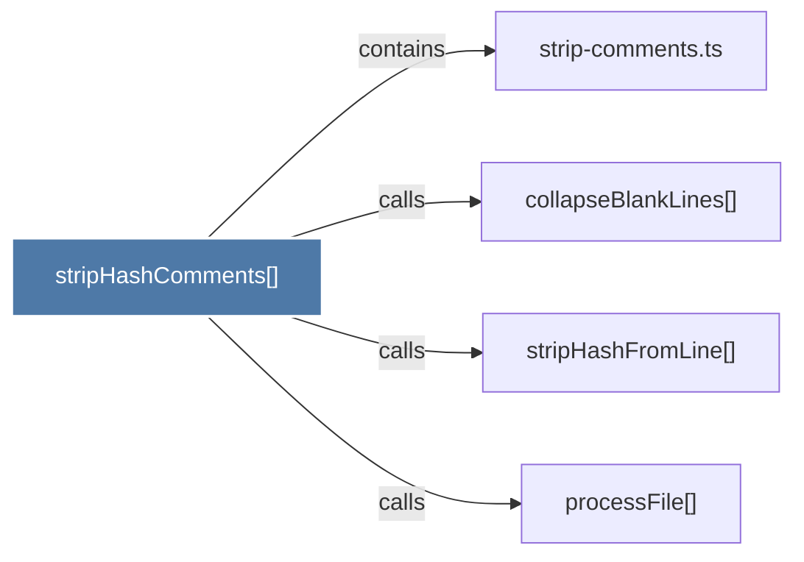

# stripHashComments()

> [!info] Properties
> **File Type**: code
> **Community**: [[_COMMUNITY_Community None|Community None]]
> **Degree**: 4

## Architecture Graph


## Outbound Connections
- [[collapseBlankLines()]] - `calls` [EXTRACTED]
- [[processFile()_1]] - `calls` [EXTRACTED]
- [[strip-comments.ts]] - `contains` [EXTRACTED]
- [[stripHashFromLine()]] - `calls` [EXTRACTED]

## Inbound Dependencies
> [!abstract]- Files that link here
```dataview
LIST
FROM [[stripHashComments()]]
```

#graphify/code #graphify/EXTRACTED #community/Community_None