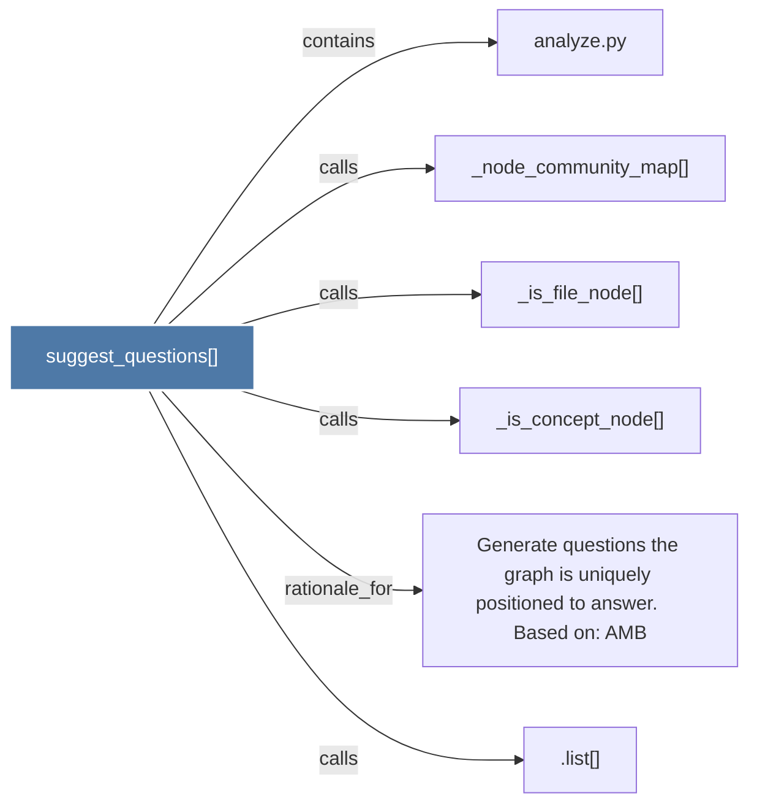

# suggest_questions()

> [!info] Properties
> **File Type**: code
> **Community**: [[_COMMUNITY_Community None|Community None]]
> **Degree**: 6

## Architecture Graph


## Outbound Connections
- [[.list()]] - `calls` [INFERRED]
- [[Generate questions the graph is uniquely positioned to answer.     Based on AMB]] - `rationale_for` [EXTRACTED]
- [[_is_concept_node()]] - `calls` [EXTRACTED]
- [[_is_file_node()]] - `calls` [EXTRACTED]
- [[_node_community_map()]] - `calls` [EXTRACTED]
- [[analyze.py]] - `contains` [EXTRACTED]

## Inbound Dependencies
> [!abstract]- Files that link here
```dataview
LIST
FROM [[suggest_questions()]]
```

#graphify/code #graphify/EXTRACTED #community/Community_None