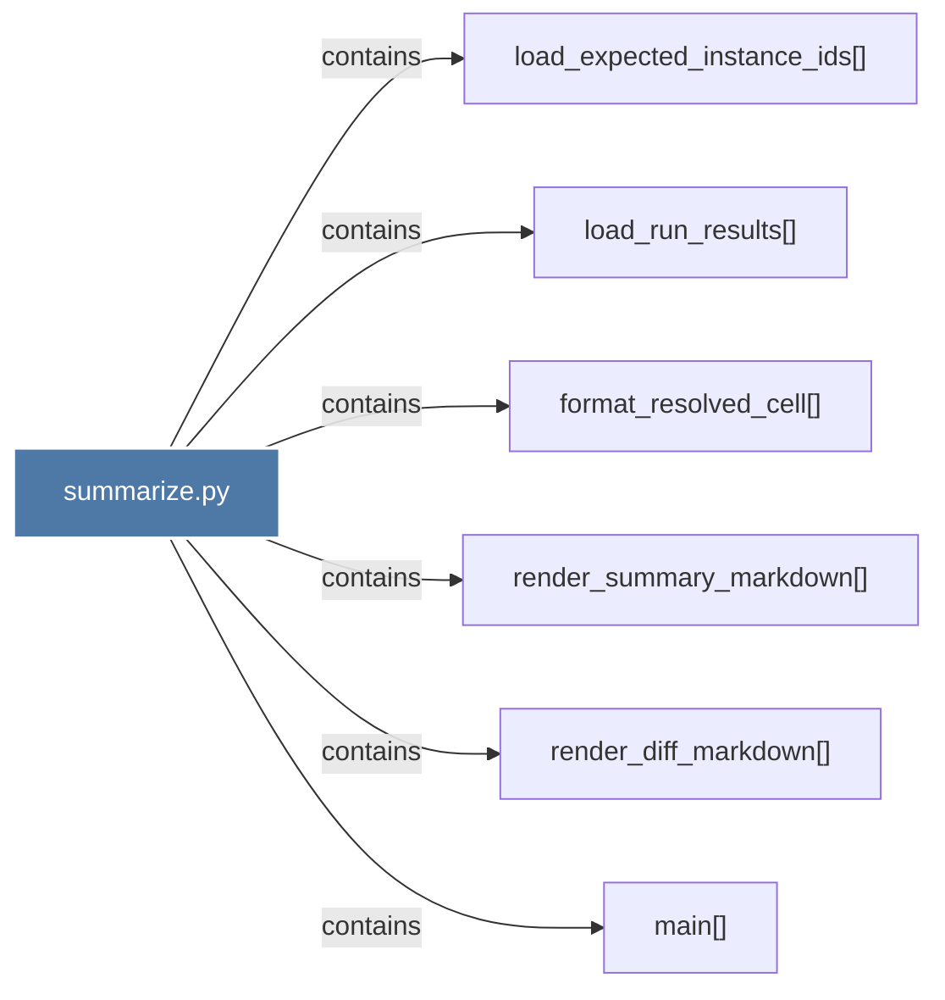

# summarize.py

> [!info] Properties
> **File Type**: code
> **Community**: [[_COMMUNITY_Community None|Community None]]
> **Degree**: 6

## Architecture Graph


## Outbound Connections
- [[format_resolved_cell()]] - `contains` [EXTRACTED]
- [[load_expected_instance_ids()]] - `contains` [EXTRACTED]
- [[load_run_results()]] - `contains` [EXTRACTED]
- [[main()_26]] - `contains` [EXTRACTED]
- [[render_diff_markdown()]] - `contains` [EXTRACTED]
- [[render_summary_markdown()]] - `contains` [EXTRACTED]

## Inbound Dependencies
> [!abstract]- Files that link here
```dataview
LIST
FROM [[summarize.py]]
```

#graphify/code #graphify/EXTRACTED #community/Community_None