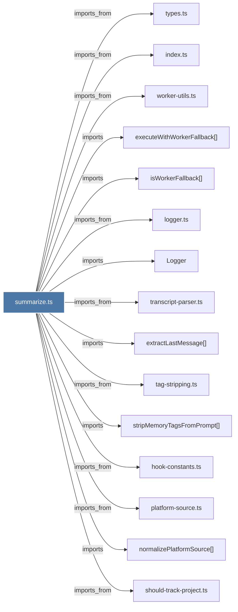

# summarize.ts

> [!info] Properties
> **File Type**: code
> **Community**: [[_COMMUNITY_Community None|Community None]]
> **Degree**: 16

## Architecture Graph


## Outbound Connections
- [[Logger]] - `imports` [EXTRACTED]
- [[executeWithWorkerFallback()]] - `imports` [EXTRACTED]
- [[extractLastMessage()]] - `imports` [EXTRACTED]
- [[hook-constants.ts]] - `imports_from` [EXTRACTED]
- [[index.ts_2]] - `imports_from` [EXTRACTED]
- [[isWorkerFallback()]] - `imports` [EXTRACTED]
- [[logger.ts]] - `imports_from` [EXTRACTED]
- [[normalizePlatformSource()]] - `imports` [EXTRACTED]
- [[platform-source.ts]] - `imports_from` [EXTRACTED]
- [[should-track-project.ts]] - `imports_from` [EXTRACTED]
- [[shouldTrackProject()]] - `imports` [EXTRACTED]
- [[stripMemoryTagsFromPrompt()]] - `imports` [EXTRACTED]
- [[tag-stripping.ts]] - `imports_from` [EXTRACTED]
- [[transcript-parser.ts]] - `imports_from` [EXTRACTED]
- [[types.ts]] - `imports_from` [EXTRACTED]
- [[worker-utils.ts]] - `imports_from` [EXTRACTED]

## Inbound Dependencies
> [!abstract]- Files that link here
```dataview
LIST
FROM [[summarize.ts]]
```

#graphify/code #graphify/EXTRACTED #community/Community_None