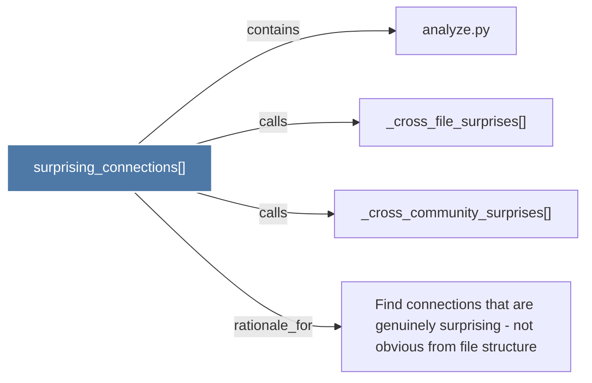

# surprising_connections()

> [!info] Properties
> **File Type**: code
> **Community**: [[_COMMUNITY_Community None|Community None]]
> **Degree**: 4

## Architecture Graph


## Outbound Connections
- [[Find connections that are genuinely surprising - not obvious from file structure_1]] - `rationale_for` [EXTRACTED]
- [[_cross_community_surprises()_1]] - `calls` [EXTRACTED]
- [[_cross_file_surprises()_1]] - `calls` [EXTRACTED]
- [[analyze.py_1]] - `contains` [EXTRACTED]

## Inbound Dependencies
> [!abstract]- Files that link here
```dataview
LIST
FROM [[surprising_connections()_1]]
```

#graphify/code #graphify/EXTRACTED #community/Community_None