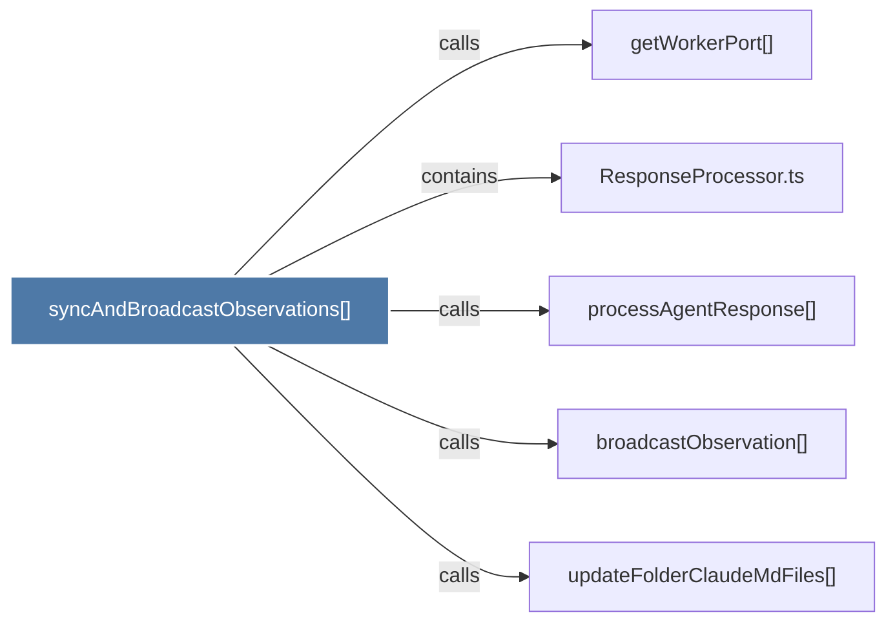

# syncAndBroadcastObservations()

> [!info] Properties
> **File Type**: code
> **Community**: [[_COMMUNITY_Community None|Community None]]
> **Degree**: 5

## Architecture Graph


## Outbound Connections
- [[ResponseProcessor.ts]] - `contains` [EXTRACTED]
- [[broadcastObservation()]] - `calls` [INFERRED]
- [[getWorkerPort()]] - `calls` [INFERRED]
- [[processAgentResponse()]] - `calls` [EXTRACTED]
- [[updateFolderClaudeMdFiles()]] - `calls` [INFERRED]

## Inbound Dependencies
> [!abstract]- Files that link here
```dataview
LIST
FROM [[syncAndBroadcastObservations()]]
```

#graphify/code #graphify/INFERRED #community/Community_None