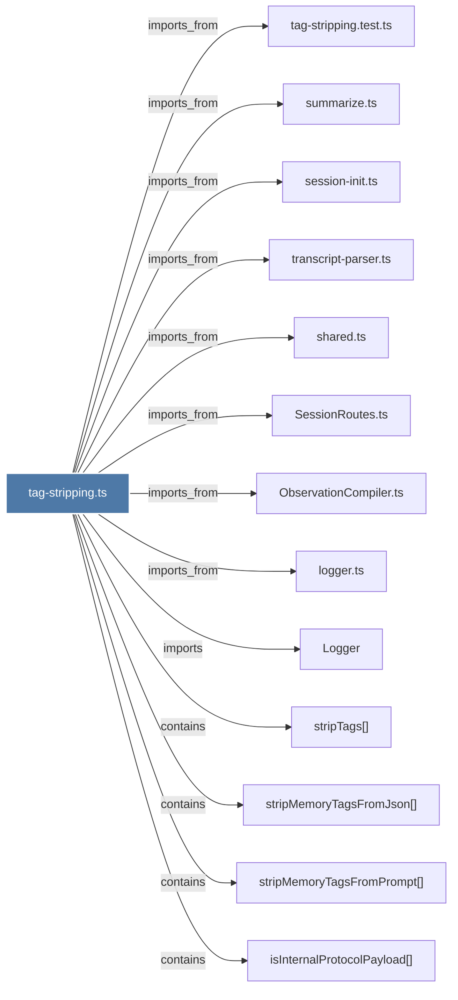

# tag-stripping.ts

> [!info] Properties
> **File Type**: code
> **Community**: [[_COMMUNITY_Community None|Community None]]
> **Degree**: 13

## Architecture Graph


## Outbound Connections
- [[Logger]] - `imports` [EXTRACTED]
- [[ObservationCompiler.ts]] - `imports_from` [EXTRACTED]
- [[SessionRoutes.ts]] - `imports_from` [EXTRACTED]
- [[isInternalProtocolPayload()]] - `contains` [EXTRACTED]
- [[logger.ts]] - `imports_from` [EXTRACTED]
- [[session-init.ts]] - `imports_from` [EXTRACTED]
- [[shared.ts]] - `imports_from` [EXTRACTED]
- [[stripMemoryTagsFromJson()]] - `contains` [EXTRACTED]
- [[stripMemoryTagsFromPrompt()]] - `contains` [EXTRACTED]
- [[stripTags()]] - `contains` [EXTRACTED]
- [[summarize.ts]] - `imports_from` [EXTRACTED]
- [[tag-stripping.test.ts]] - `imports_from` [EXTRACTED]
- [[transcript-parser.ts]] - `imports_from` [EXTRACTED]

## Inbound Dependencies
> [!abstract]- Files that link here
```dataview
LIST
FROM [[tag-stripping.ts]]
```

#graphify/code #graphify/EXTRACTED #community/Community_None