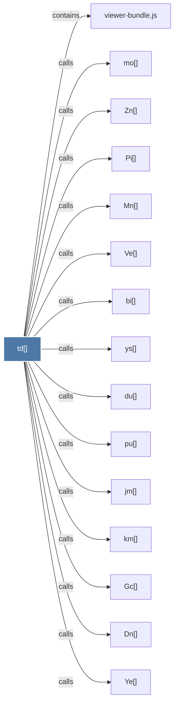

# td()

> [!info] Properties
> **File Type**: code
> **Community**: [[_COMMUNITY_Community None|Community None]]
> **Degree**: 19

## Architecture Graph


## Outbound Connections
- [[Dn()]] - `calls` [EXTRACTED]
- [[Gc()]] - `calls` [EXTRACTED]
- [[Mn()]] - `calls` [EXTRACTED]
- [[Pi()]] - `calls` [EXTRACTED]
- [[Sg()]] - `calls` [EXTRACTED]
- [[Tl()]] - `calls` [EXTRACTED]
- [[Ve()]] - `calls` [EXTRACTED]
- [[Ye()]] - `calls` [EXTRACTED]
- [[Zn()]] - `calls` [EXTRACTED]
- [[bi()]] - `calls` [EXTRACTED]
- [[du()]] - `calls` [EXTRACTED]
- [[jm()]] - `calls` [EXTRACTED]
- [[km()]] - `calls` [EXTRACTED]
- [[mo()]] - `calls` [EXTRACTED]
- [[pu()]] - `calls` [EXTRACTED]
- [[qt()]] - `calls` [EXTRACTED]
- [[render()]] - `calls` [EXTRACTED]
- [[viewer-bundle.js]] - `contains` [EXTRACTED]
- [[ys()]] - `calls` [EXTRACTED]

## Inbound Dependencies
> [!abstract]- Files that link here
```dataview
LIST
FROM [[td()]]
```

#graphify/code #graphify/EXTRACTED #community/Community_None