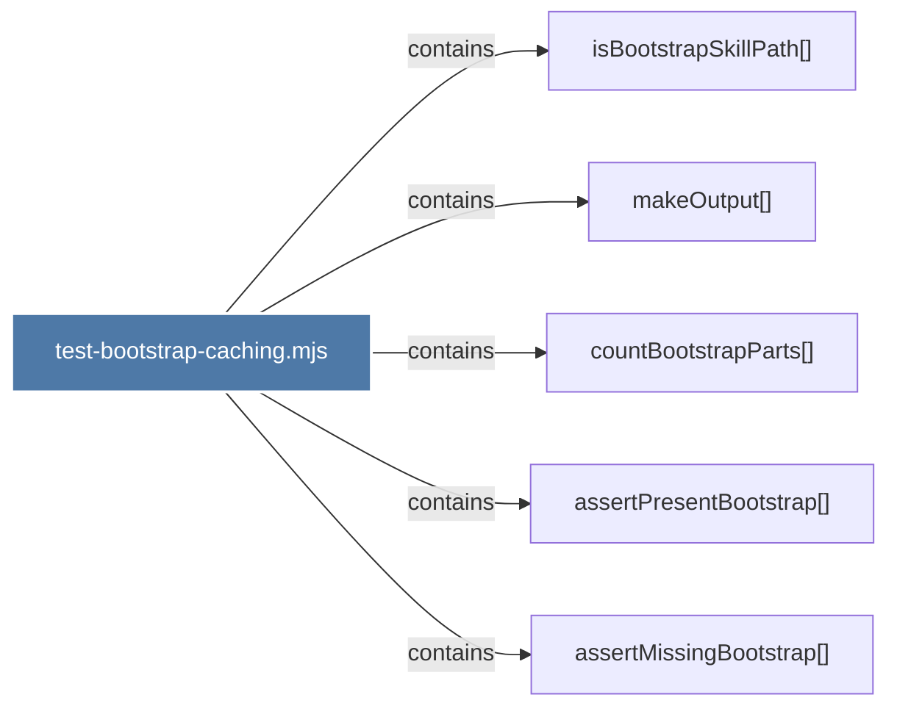

# test-bootstrap-caching.mjs

> [!info] Properties
> **File Type**: code
> **Community**: [[_COMMUNITY_Community None|Community None]]
> **Degree**: 5

## Architecture Graph


## Outbound Connections
- [[assertMissingBootstrap()]] - `contains` [EXTRACTED]
- [[assertPresentBootstrap()]] - `contains` [EXTRACTED]
- [[countBootstrapParts()]] - `contains` [EXTRACTED]
- [[isBootstrapSkillPath()]] - `contains` [EXTRACTED]
- [[makeOutput()]] - `contains` [EXTRACTED]

## Inbound Dependencies
> [!abstract]- Files that link here
```dataview
LIST
FROM [[test-bootstrap-caching.mjs]]
```

#graphify/code #graphify/EXTRACTED #community/Community_None