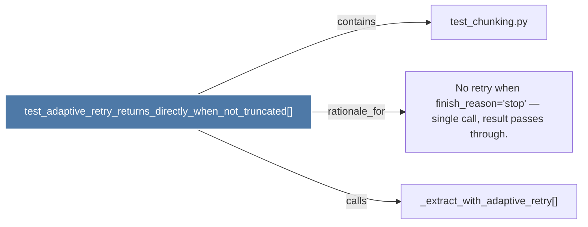

# test_adaptive_retry_returns_directly_when_not_truncated()

> [!info] Properties
> **File Type**: code
> **Community**: [[_COMMUNITY_Community None|Community None]]
> **Degree**: 3

## Architecture Graph


## Outbound Connections
- [[No retry when finish_reason='stop' — single call, result passes through.]] - `rationale_for` [EXTRACTED]
- [[_extract_with_adaptive_retry()]] - `calls` [INFERRED]
- [[test_chunking.py]] - `contains` [EXTRACTED]

## Inbound Dependencies
> [!abstract]- Files that link here
```dataview
LIST
FROM [[test_adaptive_retry_returns_directly_when_not_truncated()]]
```

#graphify/code #graphify/EXTRACTED #community/Community_None