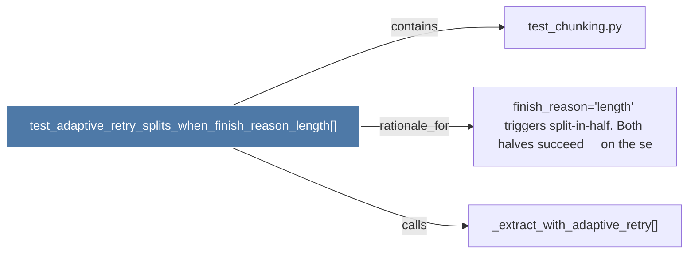

# test_adaptive_retry_splits_when_finish_reason_length()

> [!info] Properties
> **File Type**: code
> **Community**: [[_COMMUNITY_Community None|Community None]]
> **Degree**: 3

## Architecture Graph


## Outbound Connections
- [[_extract_with_adaptive_retry()]] - `calls` [INFERRED]
- [[finish_reason='length' triggers split-in-half. Both halves succeed     on the se]] - `rationale_for` [EXTRACTED]
- [[test_chunking.py]] - `contains` [EXTRACTED]

## Inbound Dependencies
> [!abstract]- Files that link here
```dataview
LIST
FROM [[test_adaptive_retry_splits_when_finish_reason_length()]]
```

#graphify/code #graphify/EXTRACTED #community/Community_None