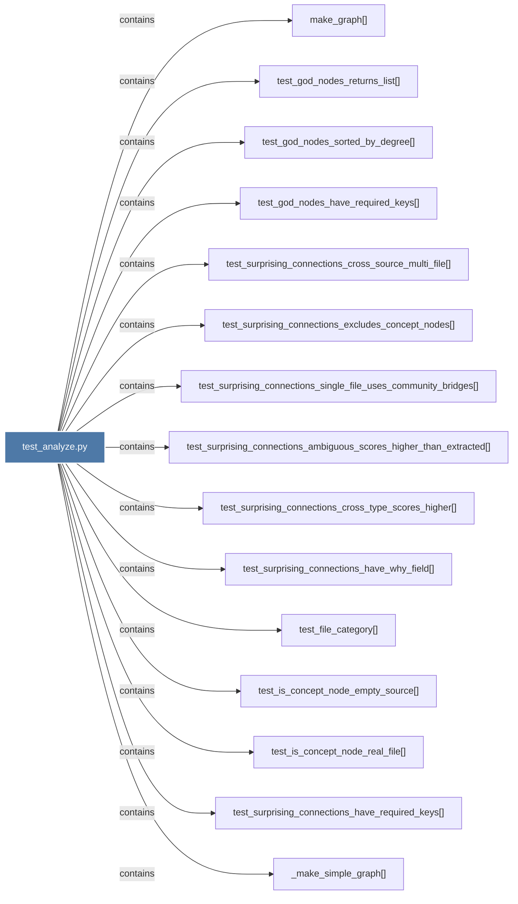

# test_analyze.py

> [!info] Properties
> **File Type**: code
> **Community**: [[_COMMUNITY_Community None|Community None]]
> **Degree**: 20

## Architecture Graph


## Outbound Connections
- [[Tests for analyze.py.]] - `rationale_for` [EXTRACTED]
- [[_make_simple_graph()]] - `contains` [EXTRACTED]
- [[make_graph()_2]] - `contains` [EXTRACTED]
- [[test_file_category()]] - `contains` [EXTRACTED]
- [[test_god_nodes_have_required_keys()]] - `contains` [EXTRACTED]
- [[test_god_nodes_returns_list()]] - `contains` [EXTRACTED]
- [[test_god_nodes_sorted_by_degree()]] - `contains` [EXTRACTED]
- [[test_graph_diff_empty_diff()]] - `contains` [EXTRACTED]
- [[test_graph_diff_new_edges()]] - `contains` [EXTRACTED]
- [[test_graph_diff_new_nodes()]] - `contains` [EXTRACTED]
- [[test_graph_diff_removed_nodes()]] - `contains` [EXTRACTED]
- [[test_is_concept_node_empty_source()]] - `contains` [EXTRACTED]
- [[test_is_concept_node_real_file()]] - `contains` [EXTRACTED]
- [[test_surprising_connections_ambiguous_scores_higher_than_extracted()]] - `contains` [EXTRACTED]
- [[test_surprising_connections_cross_source_multi_file()]] - `contains` [EXTRACTED]
- [[test_surprising_connections_cross_type_scores_higher()]] - `contains` [EXTRACTED]
- [[test_surprising_connections_excludes_concept_nodes()]] - `contains` [EXTRACTED]
- [[test_surprising_connections_have_required_keys()]] - `contains` [EXTRACTED]
- [[test_surprising_connections_have_why_field()]] - `contains` [EXTRACTED]
- [[test_surprising_connections_single_file_uses_community_bridges()]] - `contains` [EXTRACTED]

## Inbound Dependencies
> [!abstract]- Files that link here
```dataview
LIST
FROM [[test_analyze.py]]
```

#graphify/code #graphify/EXTRACTED #community/Community_None