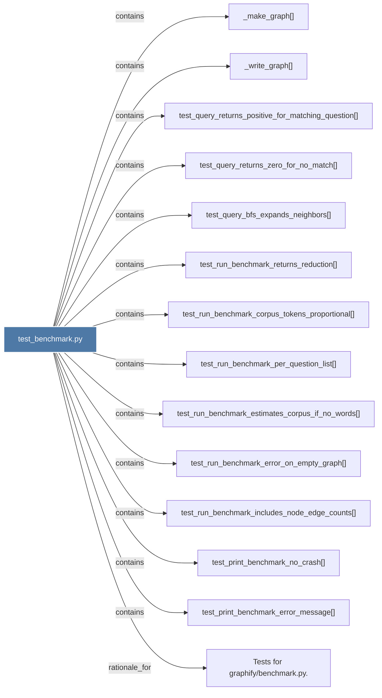

# test_benchmark.py

> [!info] Properties
> **File Type**: code
> **Community**: [[_COMMUNITY_Community None|Community None]]
> **Degree**: 14

## Architecture Graph


## Outbound Connections
- [[Tests for graphifybenchmark.py.]] - `rationale_for` [EXTRACTED]
- [[_make_graph()]] - `contains` [EXTRACTED]
- [[_write_graph()]] - `contains` [EXTRACTED]
- [[test_print_benchmark_error_message()]] - `contains` [EXTRACTED]
- [[test_print_benchmark_no_crash()]] - `contains` [EXTRACTED]
- [[test_query_bfs_expands_neighbors()]] - `contains` [EXTRACTED]
- [[test_query_returns_positive_for_matching_question()]] - `contains` [EXTRACTED]
- [[test_query_returns_zero_for_no_match()]] - `contains` [EXTRACTED]
- [[test_run_benchmark_corpus_tokens_proportional()]] - `contains` [EXTRACTED]
- [[test_run_benchmark_error_on_empty_graph()]] - `contains` [EXTRACTED]
- [[test_run_benchmark_estimates_corpus_if_no_words()]] - `contains` [EXTRACTED]
- [[test_run_benchmark_includes_node_edge_counts()]] - `contains` [EXTRACTED]
- [[test_run_benchmark_per_question_list()]] - `contains` [EXTRACTED]
- [[test_run_benchmark_returns_reduction()]] - `contains` [EXTRACTED]

## Inbound Dependencies
> [!abstract]- Files that link here
```dataview
LIST
FROM [[test_benchmark.py]]
```

#graphify/code #graphify/EXTRACTED #community/Community_None