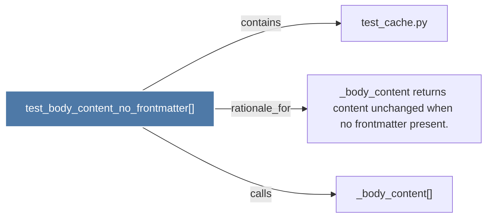

# test_body_content_no_frontmatter()

> [!info] Properties
> **File Type**: code
> **Community**: [[_COMMUNITY_Community None|Community None]]
> **Degree**: 3

## Architecture Graph


## Outbound Connections
- [[_body_content returns content unchanged when no frontmatter present.]] - `rationale_for` [EXTRACTED]
- [[_body_content()]] - `calls` [INFERRED]
- [[test_cache.py]] - `contains` [EXTRACTED]

## Inbound Dependencies
> [!abstract]- Files that link here
```dataview
LIST
FROM [[test_body_content_no_frontmatter()]]
```

#graphify/code #graphify/EXTRACTED #community/Community_None