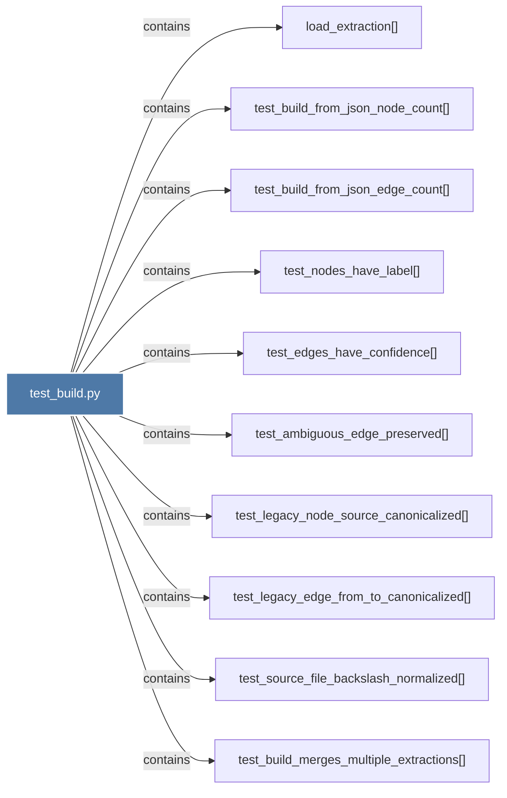

# test_build.py

> [!info] Properties
> **File Type**: code
> **Community**: [[_COMMUNITY_Community None|Community None]]
> **Degree**: 10

## Architecture Graph


## Outbound Connections
- [[load_extraction()]] - `contains` [EXTRACTED]
- [[test_ambiguous_edge_preserved()]] - `contains` [EXTRACTED]
- [[test_build_from_json_edge_count()]] - `contains` [EXTRACTED]
- [[test_build_from_json_node_count()]] - `contains` [EXTRACTED]
- [[test_build_merges_multiple_extractions()]] - `contains` [EXTRACTED]
- [[test_edges_have_confidence()]] - `contains` [EXTRACTED]
- [[test_legacy_edge_from_to_canonicalized()]] - `contains` [EXTRACTED]
- [[test_legacy_node_source_canonicalized()]] - `contains` [EXTRACTED]
- [[test_nodes_have_label()]] - `contains` [EXTRACTED]
- [[test_source_file_backslash_normalized()]] - `contains` [EXTRACTED]

## Inbound Dependencies
> [!abstract]- Files that link here
```dataview
LIST
FROM [[test_build.py]]
```

#graphify/code #graphify/EXTRACTED #community/Community_None