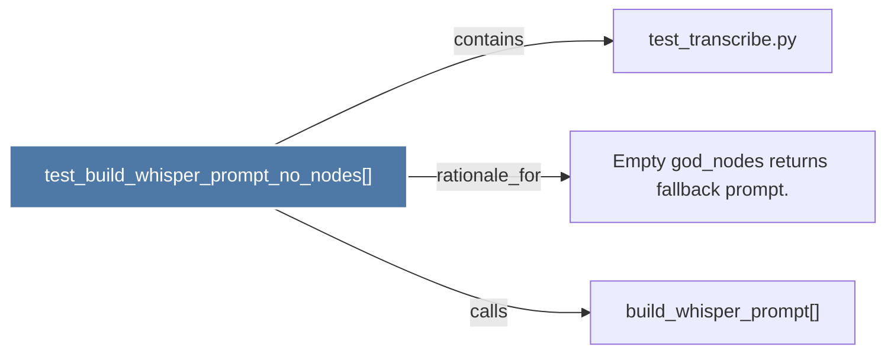

# test_build_whisper_prompt_no_nodes()

> [!info] Properties
> **File Type**: code
> **Community**: [[_COMMUNITY_Community None|Community None]]
> **Degree**: 3

## Architecture Graph


## Outbound Connections
- [[Empty god_nodes returns fallback prompt.]] - `rationale_for` [EXTRACTED]
- [[build_whisper_prompt()]] - `calls` [INFERRED]
- [[test_transcribe.py]] - `contains` [EXTRACTED]

## Inbound Dependencies
> [!abstract]- Files that link here
```dataview
LIST
FROM [[test_build_whisper_prompt_no_nodes()]]
```

#graphify/code #graphify/EXTRACTED #community/Community_None