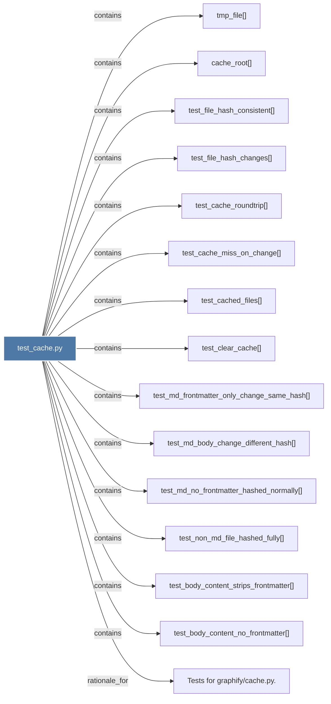

# test_cache.py

> [!info] Properties
> **File Type**: code
> **Community**: [[_COMMUNITY_Community None|Community None]]
> **Degree**: 15

## Architecture Graph


## Outbound Connections
- [[Tests for graphifycache.py.]] - `rationale_for` [EXTRACTED]
- [[cache_root()]] - `contains` [EXTRACTED]
- [[test_body_content_no_frontmatter()]] - `contains` [EXTRACTED]
- [[test_body_content_strips_frontmatter()]] - `contains` [EXTRACTED]
- [[test_cache_miss_on_change()]] - `contains` [EXTRACTED]
- [[test_cache_roundtrip()]] - `contains` [EXTRACTED]
- [[test_cached_files()]] - `contains` [EXTRACTED]
- [[test_clear_cache()]] - `contains` [EXTRACTED]
- [[test_file_hash_changes()]] - `contains` [EXTRACTED]
- [[test_file_hash_consistent()]] - `contains` [EXTRACTED]
- [[test_md_body_change_different_hash()]] - `contains` [EXTRACTED]
- [[test_md_frontmatter_only_change_same_hash()]] - `contains` [EXTRACTED]
- [[test_md_no_frontmatter_hashed_normally()]] - `contains` [EXTRACTED]
- [[test_non_md_file_hashed_fully()]] - `contains` [EXTRACTED]
- [[tmp_file()]] - `contains` [EXTRACTED]

## Inbound Dependencies
> [!abstract]- Files that link here
```dataview
LIST
FROM [[test_cache.py]]
```

#graphify/code #graphify/EXTRACTED #community/Community_None