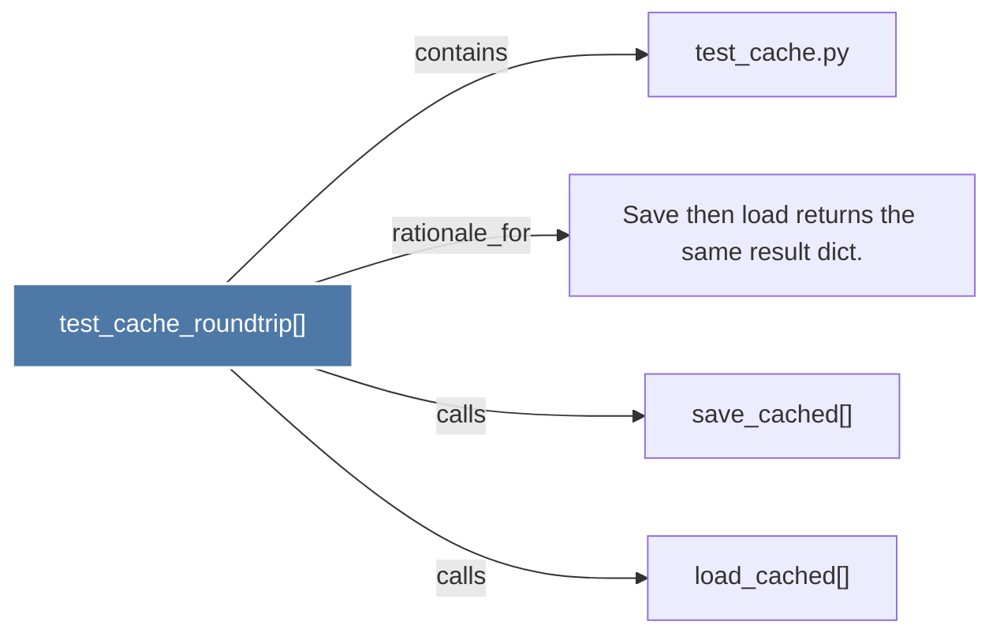

# test_cache_roundtrip()

> [!info] Properties
> **File Type**: code
> **Community**: [[_COMMUNITY_Community None|Community None]]
> **Degree**: 4

## Architecture Graph


## Outbound Connections
- [[Save then load returns the same result dict.]] - `rationale_for` [EXTRACTED]
- [[load_cached()]] - `calls` [INFERRED]
- [[save_cached()]] - `calls` [INFERRED]
- [[test_cache.py]] - `contains` [EXTRACTED]

## Inbound Dependencies
> [!abstract]- Files that link here
```dataview
LIST
FROM [[test_cache_roundtrip()]]
```

#graphify/code #graphify/EXTRACTED #community/Community_None