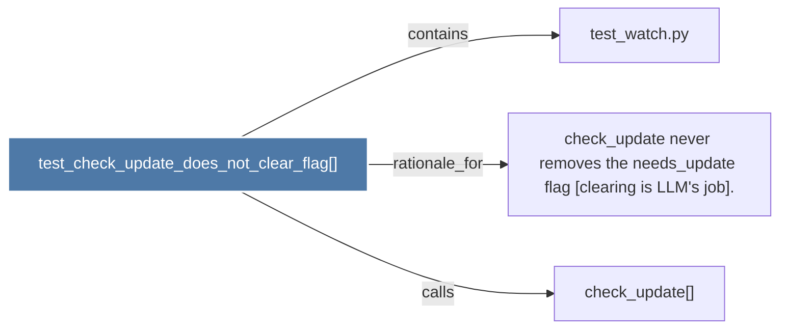

# test_check_update_does_not_clear_flag()

> [!info] Properties
> **File Type**: code
> **Community**: [[_COMMUNITY_Community None|Community None]]
> **Degree**: 3

## Architecture Graph


## Outbound Connections
- [[check_update never removes the needs_update flag (clearing is LLM's job).]] - `rationale_for` [EXTRACTED]
- [[check_update()]] - `calls` [INFERRED]
- [[test_watch.py]] - `contains` [EXTRACTED]

## Inbound Dependencies
> [!abstract]- Files that link here
```dataview
LIST
FROM [[test_check_update_does_not_clear_flag()]]
```

#graphify/code #graphify/EXTRACTED #community/Community_None