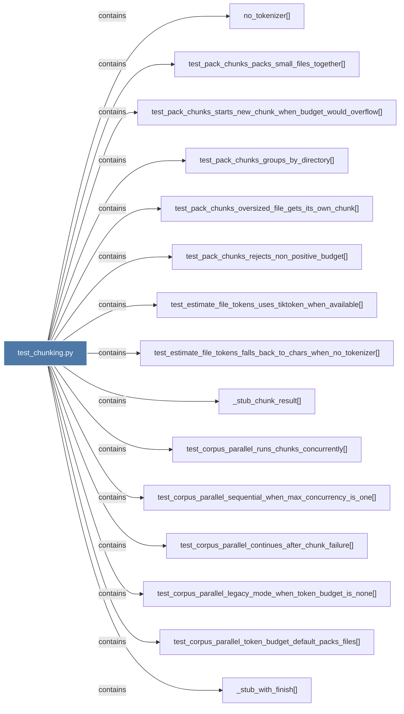

# test_chunking.py

> [!info] Properties
> **File Type**: code
> **Community**: [[_COMMUNITY_Community None|Community None]]
> **Degree**: 22

## Architecture Graph


## Outbound Connections
- [[Tests for token-aware chunking and parallel chunk execution in graphify.llm.]] - `rationale_for` [EXTRACTED]
- [[_stub_chunk_result()]] - `contains` [EXTRACTED]
- [[_stub_with_finish()]] - `contains` [EXTRACTED]
- [[no_tokenizer()]] - `contains` [EXTRACTED]
- [[test_adaptive_retry_caps_at_max_depth()]] - `contains` [EXTRACTED]
- [[test_adaptive_retry_recurses_for_persistent_truncation()]] - `contains` [EXTRACTED]
- [[test_adaptive_retry_returns_directly_when_not_truncated()]] - `contains` [EXTRACTED]
- [[test_adaptive_retry_single_file_truncation_does_not_recurse()]] - `contains` [EXTRACTED]
- [[test_adaptive_retry_splits_when_finish_reason_length()]] - `contains` [EXTRACTED]
- [[test_corpus_parallel_continues_after_chunk_failure()]] - `contains` [EXTRACTED]
- [[test_corpus_parallel_legacy_mode_when_token_budget_is_none()]] - `contains` [EXTRACTED]
- [[test_corpus_parallel_runs_chunks_concurrently()]] - `contains` [EXTRACTED]
- [[test_corpus_parallel_sequential_when_max_concurrency_is_one()]] - `contains` [EXTRACTED]
- [[test_corpus_parallel_token_budget_default_packs_files()]] - `contains` [EXTRACTED]
- [[test_corpus_parallel_uses_adaptive_retry()]] - `contains` [EXTRACTED]
- [[test_estimate_file_tokens_falls_back_to_chars_when_no_tokenizer()]] - `contains` [EXTRACTED]
- [[test_estimate_file_tokens_uses_tiktoken_when_available()]] - `contains` [EXTRACTED]
- [[test_pack_chunks_groups_by_directory()]] - `contains` [EXTRACTED]
- [[test_pack_chunks_oversized_file_gets_its_own_chunk()]] - `contains` [EXTRACTED]
- [[test_pack_chunks_packs_small_files_together()]] - `contains` [EXTRACTED]
- [[test_pack_chunks_rejects_non_positive_budget()]] - `contains` [EXTRACTED]
- [[test_pack_chunks_starts_new_chunk_when_budget_would_overflow()]] - `contains` [EXTRACTED]

## Inbound Dependencies
> [!abstract]- Files that link here
```dataview
LIST
FROM [[test_chunking.py]]
```

#graphify/code #graphify/EXTRACTED #community/Community_None